# Software Architecture Document — SpendSense AI

---

## 1. Logical View — Kiến trúc Tổng thể

SpendSense AI được xây dựng theo kiến trúc **3 tầng** kết hợp với mô hình **5 luồng xử lý dữ liệu**.

### Tầng 1 — Presentation (Giao diện người dùng)

Là ứng dụng Web (React) mà người dùng trực tiếp tương tác. Tầng này chịu trách nhiệm:
- Hiển thị danh sách insight, biểu đồ thống kê và báo cáo chi tiêu.
- Nhận ảnh hóa đơn từ camera hoặc thư viện ảnh.
- Gửi feedback (xác nhận / từ chối) cho từng insight.
- Hiển thị lịch sử giao dịch, mục tiêu tài chính, danh mục đầu tư và báo cáo.
- Tầng này **không chứa logic nghiệp vụ**.

### Tầng 2 — Application (Xử lý nghiệp vụ)

Đây là phần lõi của hệ thống, toàn bộ logic nghiệp vụ diễn ra ở đây. Tầng này xử lý 5 luồng dữ liệu song song:

| Luồng | Tên | Mô tả tóm tắt |
|-------|-----|----------------|
| **Luồng 1** | Data Ingestion | Chụp hóa đơn → OCR → Embedding → Semantic Cache → LLM Insight ✅ |
| **Luồng 2** | Cash Flow | Quản lý giao dịch, mục tiêu tài chính, tùy chọn người dùng ✅ |
| **Luồng 3** | Investment & Stress Test | Theo dõi danh mục đầu tư + stress-test vĩ mô + đề xuất hedging (PA3) ✅ |
| **Luồng 4** | Resource Optimization | Phát hiện chi tiêu bất thường, cảnh báo 🔧 (mới có cờ bật/tắt, chưa có logic) |
| **Luồng 5** | Reporting | Tổng hợp báo cáo tài chính + nhận xét AI (on-demand) ✅ |

### Tầng 3 — Data (Lưu trữ dữ liệu)

Gồm hai kho lưu trữ chính:
- **PostgreSQL** (Relational Store): lưu người dùng, hóa đơn, giao dịch, mục tiêu, danh mục đầu tư, tùy chọn người dùng (8 bảng — §5).
- **ChromaDB** (Vector DB): lưu embedding hóa đơn và insight đã sinh, phục vụ Semantic Cache cho Luồng 1.

Tầng này **chỉ được truy cập bởi Tầng 2**, không bao giờ trực tiếp từ Tầng 1.

---

## 2. Luồng Dữ liệu Chi tiết

### Luồng 1 — Data Ingestion (Phân tích Hóa đơn)

```
Receipt Image (upload)
       │
       ▼
[YOLOv11 Detector]  ──────── phát hiện và crop vùng hóa đơn
       │
       ▼
[VietOCR Extractor] ───────── trích xuất text → Receipt object
       │
       ▼
[Sentence-Transformer Embedder] ── chuyển canonical_text → vector 384 chiều
       │
       ▼
[ChromaDB VectorStore — cache_lookup]
       │
       ├── similarity ≥ 0.9 ──► trả về Insight (source=CACHE) ─► API Response
       │
       └── similarity < 0.9
              │
              ▼
       [Gemini 2.5 Flash] ── generate_insight(Receipt) → Insight (source=LLM)
              │
              ▼
       [ChromaDB — cache_store] ── lưu vector + metadata
              │
              ▼
           API Response

Feedback:
  CONFIRM → vector giữ lại trong ChromaDB
  REJECT  → cache_delete(vector_id) → xóa khỏi ChromaDB (unlearning)
```

### Luồng 2 — Cash Flow (Quản lý Dòng tiền) ✅

```
User Input (giao dịch / mục tiêu / tùy chọn)
       │
       ▼
[transactions / goals / preferences routes]
       │
       ├── Tạo / cập nhật Transaction (expense | income)
       ├── (tùy chọn) gắn receipt_id + receipt_items
       ├── CRUD FinancialGoal  (progress tính khi đọc)
       └── Đọc / ghi UserPreferences
       │
       ▼
[PostgreSQL]
  ├── transactions     (lịch sử giao dịch)
  ├── receipts / receipt_items
  ├── financial_goals  (mục tiêu tiết kiệm)
  └── user_preferences (cờ thông báo)
       │
       ▼
Dashboard
```

> Không có bảng/khái niệm `wallets` hay số dư ví trong code hiện tại.

### Luồng 3 — Investment & Stress Test (PA3) ✅

```
User Portfolio Input (profile + assets)
       │
       ▼
[investment route]
       │
       ├── CRUD investment_profiles (risk_appetite, capital, goal)
       ├── CRUD investment_assets   (stock | gold | saving | crypto)
       │
       ▼
[core.market_data.get_market_prices()] ── giá real-time (vnstock / Binance / SJC)
       │
       ▼
[core.stress_tester.run_portfolio_stress_test()]
       ├── 4 kịch bản shock + vulnerability / diversification score
       └── Gemini (_call_gemini) → overall_analysis + hedging_strategies
       │
       ▼
StressTestResponse (scenarios, assets, hedging)
```

### Luồng 4 — Resource Optimization (Tối ưu Nguồn lực) 🔧 Planned

```
(Chưa triển khai — dự kiến)
Scheduled Job / Trigger
       │
       ▼
[OptimizationService — planned]
       ├── Phân tích patterns từ transactions (N ngày gần nhất)
       ├── Phát hiện chi tiêu bất thường (anomaly detection)
       ├── So sánh với financial_goals → budget gap
       └── LLM → gợi ý + tạo Alert (cần thêm bảng alerts)
       │
       ▼
Push Notification / Email Alert → User

Hiện tại: chỉ có cờ anomaly_alerts / goal_reminders trong user_preferences.
```

### Luồng 5 — Reporting (Báo cáo) ✅ on-demand

```
GET /reports/summary?range=...
       │
       ▼
[reports.get_financial_report()]
       │
       ├── SELECT transactions / financial_goals / investment_assets (theo range)
       ├── Aggregate in-memory (income/expense/net, category breakdown...)
       ├── gemini_client.generate_financial_report_review() → ai_review (+ fallback)
       │
       ▼
FinancialReportResponse → Presentation Layer (tự render biểu đồ)
       (KHÔNG ghi bảng reports/charts)
```

---

## 3. Danh sách Component

| Component | Lớp triển khai | Luồng | Trạng thái | Vai trò |
|---|---|---|---|---|
| **Backend API & Routing** | `main.py`, `src/api/routes/` (10 router), `src/api/schemas.py` | Tất cả | ✅ Implemented | FastAPI entrypoint, định tuyến request, DTO validation |
| **Auth Module** | `src/auth/service.py`, `src/auth/dependencies.py` | Tất cả | ✅ Implemented | JWT (PyJWT), bcrypt, dependency injection |
| **CV & OCR Module** | `src/vision/detector.py`, `ocr.py`, `reconstructor.py` | Luồng 1 | ✅ Implemented¹ | YOLOv11 detect, VietOCR extract, ghép field → Receipt |
| **Embedding Module** | `src/embedding/embedder.py` | Luồng 1 | ✅ Implemented¹ | sentence-transformers → vector 384 chiều |
| **Semantic Cache** | `src/cache/vector_store.py` | Luồng 1 | ✅ Implemented | ChromaDB lookup/store/delete |
| **LLM Module** | `src/llm/gemini_client.py` | Luồng 1, 5 | ✅ Implemented | Gemini/Gemma — insight, phân loại item, report review |
| **Pipeline Orchestrator** | `src/pipeline.py`, `src/core/tool_result.py` | Luồng 1 | ✅ Implemented | Điều phối các bước xử lý hóa đơn |
| **Domain Models** | `src/models/expense.py` | Luồng 1 | ✅ Implemented | Pydantic: Receipt, ReceiptItem, Insight |
| **Database Layer** | `src/db/models.py`, `src/db/base.py` | Tất cả | ✅ Implemented | SQLAlchemy async (8 bảng), PostgreSQL |
| **Cash Flow (Transactions/Goals/Preferences)** | `src/api/routes/transactions.py`, `goals.py`, `preferences.py` | Luồng 2 | ✅ Implemented | CRUD giao dịch, mục tiêu, cấu hình người dùng |
| **Investment & Stress Test (PA3)** | `src/api/routes/investment.py`, `src/core/stress_tester.py`, `src/core/market_data.py` | Luồng 3 | ✅ Implemented | Theo dõi danh mục + stress-test vĩ mô + hedging |
| **Market Intelligence** | `src/services/market_data_service.py`, `market_context_service.py`, `src/api/routes/market.py` | Luồng 3 | ✅ Implemented | Giá thị trường real-time (vnstock/Binance/SJC), tin tức |
| **Reporting** | `src/api/routes/reports.py` | Luồng 5 | ✅ Implemented² | Tổng hợp báo cáo tài chính + nhận xét AI |
| **Resource Optimization** | — | Luồng 4 | 🔧 Planned | Anomaly detection + alert service (chưa triển khai) |

> **Ghi chú:**
> - ✅ Implemented = đã có trong codebase hiện tại. 🔧 Planned = chưa triển khai.
> - ¹ CV/OCR và Embedding dùng **model thật**, tự suy giảm về fallback xác định (stub) khi weights/thiết bị không sẵn sàng — không còn là stub thuần.
> - ² Báo cáo được **tính on-demand** ở route (không lưu bảng `reports`/`charts`).
> - Luồng 4 (Resource Optimization) hiện chỉ có *cờ bật/tắt* trong `user_preferences` (`anomaly_alerts`); chưa có service phân tích/alert.
> - Tầng xử lý (vision/ocr/embedding/cache/llm/pipeline/stress-test/market/auth) hiện thực bằng **module hàm** trả `ToolResult` — không phải class (xem quy ước §4).

---

### 3.1 Backend API

| Mục | Nội dung |
|-----|----------|
| **Lớp triển khai** | `main.py` + 10 router trong `src/api/routes/`: `auth.py`, `receipts.py`, `transactions.py`, `feedback.py`, `insights.py`, `investment.py`, `goals.py`, `preferences.py`, `reports.py`, `market.py`; DTO trong `src/api/schemas.py` |
| **Trách nhiệm** | Là điểm vào duy nhất của hệ thống. Tiếp nhận HTTP request, validate input qua Pydantic schema, điều hướng đến handler phù hợp, serialize kết quả thành JSON response. Cấu hình CORS và quản lý lifespan (`_warm_up_models()` nạp sẵn YOLO/VietOCR/Embedding khi startup). Mỗi router là instance `APIRouter`, handler là `async def`. |
| **Kết nối đến component khác** | → **Auth Module**: inject `get_current_user` qua `Depends()` vào mọi route cần xác thực. → **Pipeline Orchestrator**: `receipts` router gọi `pipeline.analyze_receipt_details()` để xử lý hóa đơn. → **Semantic Cache**: `feedback` router gọi `cache_delete()` khi REJECT; `insights` router gọi `list_insights()` / `get_insight()`. → **Cash Flow / Investment / Reporting / Market**: các router tương ứng gọi service/module nghiệp vụ. → **Domain Models / Schemas**: dùng Pydantic `*Request` / `*Response` để validate và serialize. |

---

### 3.2 Auth Module

| Mục | Nội dung |
|-----|----------|
| **Lớp triển khai** | `src/auth/service.py`, `src/auth/dependencies.py` |
| **Trách nhiệm** | Hai module hàm: `service` (hash/verify bcrypt, tạo & decode JWT bằng PyJWT, `user_id_from_email` cho Google login) và `dependencies` (`get_current_user`). Cung cấp FastAPI dependency `get_current_user` — decode token, query DB lấy `User`; nếu DB offline trả `AuthenticatedUser` (dataclass) dựng từ claim để degrade graceful. Là cổng kiểm soát quyền truy cập của toàn hệ thống. |
| **Kết nối đến component khác** | → **Database Layer**: `db.get(User, id)` khi decode token; route `auth` xác minh email khi đăng ký. ← **Backend API**: inject vào mọi route có bảo vệ qua `Depends()`. |

---

### 3.3 CV & OCR Module

| Mục | Nội dung |
|-----|----------|
| **Lớp triển khai** | `src/vision/detector.py` (YOLOv11), `src/vision/ocr.py` (VietOCR), `src/vision/reconstructor.py` |
| **Trách nhiệm** | Ba module hàm. `detector.detect_receipt()`: dùng YOLOv11 phát hiện vùng/field hóa đơn và crop. `ocr.extract_receipt()`: dùng VietOCR đọc text từng box/line. `reconstructor.reconstruct_receipt()`: ghép các field đã OCR (merchant, item, price, discount) thành `Receipt` có cấu trúc + danh sách draft item theo vị trí hình học. **Dùng model thật**; tự suy giảm về fallback khi weights/thiết bị không sẵn sàng (không phải stub thuần). |
| **Kết nối đến component khác** | ← **Pipeline Orchestrator**: bước `detect_receipt` → `extract_receipt` → `reconstruct_receipt` trong chuỗi Luồng 1. → **Domain Models**: tạo `Receipt` và `ReceiptItem`. Đầu ra (`ToolResult.data`) được chuyển tiếp sang Embedding Module. |

---

### 3.4 Embedding Module

| Mục | Nội dung |
|-----|----------|
| **Lớp triển khai** | `src/embedding/embedder.py` |
| **Trách nhiệm** | Module hàm. `embed_text()` nhận chuỗi chuẩn hóa từ `Receipt.canonical_text`, dùng model `all-MiniLM-L6-v2` (sentence-transformers, cache `@lru_cache`) chuyển thành vector float32 384 chiều, L2-normalized. Cùng nội dung hóa đơn → cùng vector để cache lookup đúng. **Có dùng model thật**; nếu không nạp được model (`_ModelUnavailable`) thì suy giảm về `_stub_vector()` (hash xác định) thay vì hard-fail. |
| **Kết nối đến component khác** | ← **Pipeline Orchestrator**: bước `embed_text` trong Luồng 1. → **Semantic Cache**: cung cấp vector 384 chiều cho `cache_lookup()` (tìm kiếm) và `cache_store()` (lưu sau khi LLM sinh insight). |

---

### 3.5 Semantic Cache

| Mục | Nội dung |
|-----|----------|
| **Lớp triển khai** | `src/cache/vector_store.py` |
| **Trách nhiệm** | Module hàm bọc ChromaDB (`chromadb.HttpClient`, collection `hnsw:space=cosine`). `cache_lookup()`: query top-1, `similarity = 1 - distance`; nếu ≥ 0.9 thì trả cached `Insight` ngay, không gọi LLM. `cache_store()`: `upsert` vector + metadata sau khi LLM sinh xong. `cache_delete()`: xóa document (unlearning) khi REJECT. `list_insights()` / `get_insight()`: truy vấn lịch sử insight theo `user_id`; `_metadata_to_insight()` dựng lại `Insight` từ metadata. |
| **Kết nối đến component khác** | ← **Pipeline Orchestrator**: gọi `cache_lookup` rồi `cache_store` trong Luồng 1. ← **Backend API** (`feedback` router): gọi `cache_delete(vector_id)` khi REJECT. ← **Backend API** (`insights` router): gọi `list_insights` / `get_insight`. → **ChromaDB** (Vector DB): add, query, delete document. |

---

### 3.6 LLM Module

| Mục | Nội dung |
|-----|----------|
| **Lớp triển khai** | `src/llm/gemini_client.py` |
| **Trách nhiệm** | Module hàm bọc REST API Google Generative AI (gọi trực tiếp bằng `httpx`, JSON mode + `responseSchema`, retry). Ba hàm public: `generate_insight()` (Luồng 1 — summary/category/tips), `classify_receipt_items()` (phân loại item bằng model **Gemma** + fallback từ khóa tiếng Việt `_guess_category`), `generate_financial_report_review()` (Luồng 5 — nhận xét tài chính). Helper `_call_gemini()` dùng chung. Thiếu `GEMINI_API_KEY` → fallback (stub insight / khac / fallback review). Luôn trả `ToolResult`. |
| **Kết nối đến component khác** | ← **Pipeline Orchestrator**: gọi `generate_insight(receipt)` khi cache miss + `classify_receipt_items()` (Luồng 1). ← **Reporting** (`reports` router): gọi `generate_financial_report_review()` (Luồng 5). ← **Stress Tester**: gọi lại `_call_gemini()` cho phân tích hedging (Luồng 3). → **Gemini API** (external): HTTP request đến `generativelanguage.googleapis.com`. <br>⚠️ Các method `portfolio_recommendation` / `optimize_spending` / `summarize_report` (thiết kế cũ) **không tồn tại**. |

---

### 3.7 Pipeline Orchestrator

| Mục | Nội dung |
|-----|----------|
| **Lớp triển khai** | `src/pipeline.py`, `src/core/tool_result.py` |
| **Trách nhiệm** | Module hàm điều phối Luồng 1: Detect → OCR → Reconstruct → Embed → Cache Lookup → (LLM + Cache Store). Hai entrypoint: `analyze_receipt()` (trả `Insight`) và `analyze_receipt_details()` (trả `dict` giàu thông tin cho UI: draft receipt, detected fields, suggested transaction, item categories). Enforce `ToolResult` contract qua `_require_ok()` — bước nào `status == ERROR` thì ném `PipelineError(step, result)` (fail-fast). Soft-fail khi `cache_store` lỗi — insight vẫn trả về. |
| **Kết nối đến component khác** | ← **Backend API** (`receipts` router): nhận `image_bytes` từ upload. → **CV & OCR Module**: gọi `detect_receipt()`, `extract_receipt()`, `reconstruct_receipt()`. → **Embedding Module**: gọi `embed_text()`. → **Semantic Cache**: gọi `cache_lookup()` / `cache_store()`. → **LLM Module**: gọi `generate_insight()` khi cache miss + `classify_receipt_items()`. |

---

### 3.8 Domain Models

| Mục | Nội dung |
|-----|----------|
| **Lớp triển khai** | `src/models/expense.py` |
| **Trách nhiệm** | Định nghĩa data contract trung tâm của Luồng 1 dưới dạng Pydantic `BaseModel`: `Receipt`, `ReceiptItem` (có `discount`, `category`), `Insight`, `FeedbackAction`, `InsightSource`. Cung cấp `Receipt.canonical_text` — `@property` chuẩn hóa nội dung hóa đơn thành chuỗi nhất quán dùng cho embedding. Tự động validate kiểu và serialize/deserialize JSON. |
| **Kết nối đến component khác** | ← **Tầng xử lý Luồng 1**: `Receipt` tạo bởi reconstructor/OCR, consumed bởi `embed_text` và `generate_insight`. `Insight` tạo bởi LLM, lưu bởi vector_store, trả về bởi pipeline. `FeedbackAction` dùng bởi `feedback` router. Là lớp dữ liệu thuần túy. (DTO API tách riêng ở `src/api/schemas.py` — §4.3; ORM tách ở `src/db/models.py` — §4.9.) |

---

### 3.9 Database Layer

| Mục | Nội dung |
|-----|----------|
| **Lớp triển khai** | `src/db/models.py` (SQLAlchemy ORM), `src/db/base.py` (`Base`, async engine, `AsyncSessionLocal`, `get_db`, `ensure_database`) |
| **Trách nhiệm** | Quản lý kết nối async đến PostgreSQL qua SQLAlchemy + asyncpg. Định nghĩa 8 ORM model (`User`, `ReceiptRecord`, `ReceiptItemRecord`, `Transaction`, `InvestmentProfile`, `InvestmentAsset`, `FinancialGoal`, `UserPreferences`). Cung cấp dependency `get_db`. `ensure_database()` tạo bảng (`create_all`) + lightweight migration (thêm cột `receipt_items.category`). |
| **Kết nối đến component khác** | ← **Auth Module**: đọc/ghi `users`. ← **Cash Flow** (`transactions`/`goals`/`preferences` routes): CRUD `transactions`, `financial_goals`, `user_preferences`. ← **Investment** (`investment` route): CRUD `investment_profiles`, `investment_assets`. ← **Receipts/Pipeline**: ghi `receipts`, `receipt_items`. ← **Reporting** (`reports` route): đọc `transactions`, `financial_goals`, `investment_assets`. → **PostgreSQL**: kết nối qua asyncpg driver. |

---

### 3.10 Cash Flow — Transactions / Goals / Preferences ✅ Implemented

| Mục | Nội dung |
|-----|----------|
| **Lớp triển khai** | `src/api/routes/transactions.py`, `src/api/routes/goals.py`, `src/api/routes/preferences.py` |
| **Trách nhiệm** | Logic Luồng 2 hiện thực **trực tiếp trong các route** (chưa tách service riêng). `transactions`: tạo/sửa/liệt kê giao dịch (`expense`/`income`), tùy chọn gắn `receipt_id` + draft items. `goals`: CRUD mục tiêu; `status`/`progress_percent` tính ở `GoalResponse.from_goal()`. `preferences`: đọc/ghi cờ thông báo người dùng. **Không có khái niệm `wallet`/số dư ví** trong code hiện tại. |
| **Kết nối đến component khác** | ← **Backend API**: là các router được mount trong `main.py`. → **Database Layer**: CRUD `transactions`, `financial_goals`, `user_preferences`. → **Schemas**: dùng `Transaction*`, `Goal*`, `Preferences*` DTO. ← **Reporting** (`reports` route): đọc lại `transactions`/`financial_goals` để tổng hợp. |

---

### 3.11 Investment & Stress Test — PA3 ✅ Implemented

| Mục | Nội dung |
|-----|----------|
| **Lớp triển khai** | `src/api/routes/investment.py`, `src/core/stress_tester.py`, `src/core/market_data.py` |
| **Trách nhiệm** | Theo dõi danh mục thực tế (không phải tư vấn từ questionnaire). `investment` route: CRUD `investment_profiles` (khẩu vị rủi ro, vốn, mục tiêu) và `investment_assets` (cổ phiếu/vàng/tiết kiệm/crypto). `stress_tester.run_portfolio_stress_test()`: định giá danh mục theo giá thật, chạy 4 kịch bản shock, tính `vulnerability_score` + `diversification_score` (Simpson Index), gọi Gemini sinh `overall_analysis` + `hedging_strategies` (có fallback tĩnh). |
| **Kết nối đến component khác** | ← **Backend API** (`investment` router): `GET/POST /profile`, `GET/POST/DELETE /portfolio`, `GET /stress-test`. → **Market Data** (`src/core/market_data.py`): lấy giá real-time. → **LLM Module**: `_call_gemini()` cho hedging. → **Database Layer**: `investment_profiles`, `investment_assets`. (Không có bảng `risk_profiles`/`investment_recommendations`.) |

---

### 3.12 Resource Optimization 🔧 Planned

| Mục | Nội dung |
|-----|----------|
| **Lớp triển khai** | _(chưa có)_ — dự kiến `src/services/optimization.py` |
| **Trạng thái hiện tại** | Chưa triển khai. Trong code mới chỉ có **cờ bật/tắt** ở bảng `user_preferences` (`anomaly_alerts`, `goal_reminders`, `rebalance_suggestions`) — chưa có logic phân tích, anomaly detection, alert hay bảng `alerts`. |
| **Trách nhiệm (dự kiến)** | Phân tích pattern chi tiêu N ngày gần nhất, phát hiện chi tiêu bất thường, so sánh với mục tiêu để tính budget gap, gọi LLM sinh gợi ý tối ưu, tạo cảnh báo khi vượt ngưỡng. |
| **Kết nối (dự kiến)** | ← **Scheduled Job / Backend API** (Luồng 4): trigger phân tích. → **LLM Module**. → **Database Layer**: đọc `transactions`, `financial_goals`; cần thêm bảng `alerts`. → **Notification System** (external). |

---

### 3.13 Reporting ✅ Implemented

| Mục | Nội dung |
|-----|----------|
| **Lớp triển khai** | `src/api/routes/reports.py` (`GET /reports/summary`) |
| **Trách nhiệm** | Báo cáo **tính on-demand** trong route (không lưu bảng `reports`/`charts`). Theo `range`: load `transactions`/`financial_goals`/`investment_assets`, tổng hợp income/expense/net/saving_rate, phân bổ danh mục, giao dịch lớn nhất, tóm tắt đầu tư + tiến độ mục tiêu. Gọi LLM (`generate_financial_report_review`) sinh nhận xét, có `_fallback_*` khi LLM không sẵn sàng. Trả `FinancialReportResponse`; **Presentation Layer tự render biểu đồ** từ `category_breakdown`. |
| **Kết nối đến component khác** | ← **Backend API** (`reports` router): nhận `range`. → **Database Layer**: đọc `transactions`, `financial_goals`, `investment_assets`. → **LLM Module**: `generate_financial_report_review(payload)`. → **Presentation Layer**: trả `FinancialReportResponse` (gồm số liệu biểu đồ). |

---

## 4. Class Diagrams — Thiết kế Hướng đối tượng

> **Quy ước biểu diễn (đọc trước khi xem sơ đồ).** SpendSense AI chia thành hai nhóm thành phần, và sơ đồ phản ánh đúng cách code được viết — không lý tưởng hóa thành OOP nếu thực tế không phải vậy:
>
> - **Tầng dữ liệu — hướng đối tượng thực sự:** các *class* Pydantic (`ToolResult`, domain model, request/response schema), SQLAlchemy ORM model, và một số `@dataclass`. Đây là nơi OOP được dùng đúng nghĩa — có thuộc tính, validation, và một số operation (factory `classmethod`, `property`, `update_balance`-style helper). Các mục §4.1–4.3, §4.9, §4.13 mô tả đầy đủ những class này.
> - **Tầng xử lý — module hàm thuần:** pipeline, vision, OCR, embedding, semantic cache, LLM, market-data, stress-test và các API route. Mỗi đơn vị là một *module* gồm các hàm không giữ state (model nặng được cache qua `@lru_cache` / singleton ở mức module), luôn trả về `ToolResult` hoặc `dict`. Chúng được biểu diễn bằng stereotype `<<module>>` liệt kê các operation public, kèm quan hệ *uses / produces* tới class dữ liệu. Đây là lựa chọn thiết kế có chủ đích (idiomatic Python, KISS/YAGNI) — không bọc hàm không-state vào "class giả" chỉ để có sơ đồ class.

---

### 4.1 Core Contract — ToolResult (`src/core/tool_result.py`)

`ToolResult` là class Pydantic chuẩn hóa giá trị trả về của **mọi** bước trong tầng xử lý, cho phép orchestrator rẽ nhánh theo `status` mà không cần biết hình dạng payload.

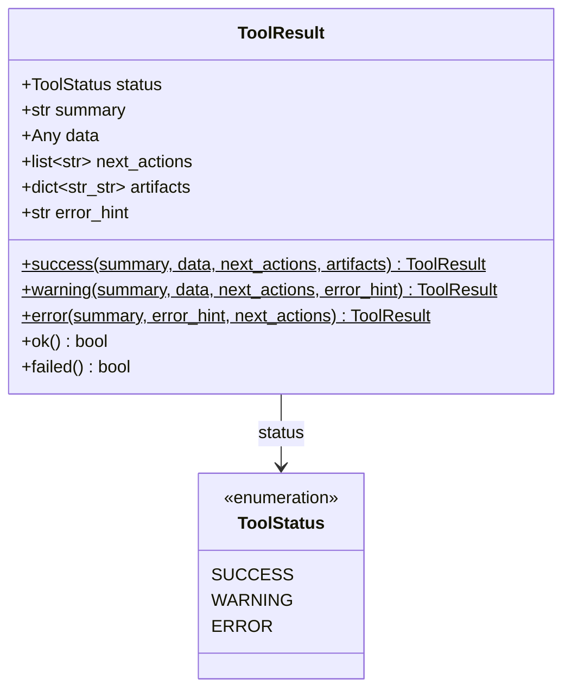

**Mô tả:**
- Ba factory `classmethod` (`success`, `warning`, `error`) là cách duy nhất nên dùng để tạo `ToolResult` — chúng set sẵn `status` và default `next_actions` hợp lý.
- Hai `@property` `ok` / `failed` được pipeline dùng để kiểm tra nhanh sau mỗi bước.

---

### 4.2 Domain Models — Receipt Pipeline (`src/models/expense.py`)

Các class Pydantic biểu diễn dữ liệu nghiệp vụ của luồng phân tích hóa đơn (Luồng 1).

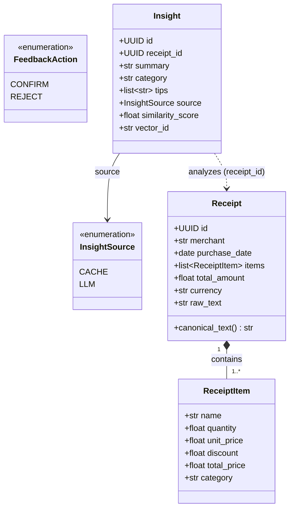

**Mô tả:**
- `ReceiptItem` gồm cả `discount` và `category` (item được Gemma phân loại) — khác với bản thiết kế ban đầu.
- `canonical_text` là một `@property` (không phải method): tạo chuỗi chuẩn hóa `merchant | items | total` dùng để embedding, đảm bảo cùng hóa đơn → cùng vector khi lookup cache.
- `Insight` mang `source` (`cache`/`llm`) và `similarity_score` để truy vết hit cache.

---

### 4.3 API Schemas — DTO Layer (`src/api/schemas.py`)

Toàn bộ request/response là Pydantic `BaseModel`, tự validate input và serialize output; không bao giờ trả thẳng ORM model ra ngoài. Dưới đây là các DTO tiêu biểu (lược bớt nhóm market/report con để dễ đọc).

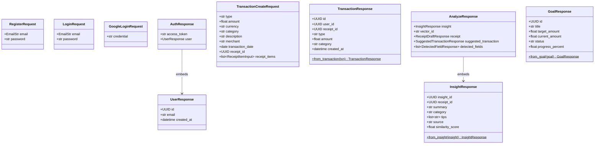

**Mô tả:**
- Nhiều response dùng `model_config = ConfigDict(from_attributes=True)` để map trực tiếp từ ORM (vd `TransactionResponse.from_transaction`, `UserResponse`).
- Một số schema chứa **logic dẫn xuất**: `GoalResponse.from_goal()` tự tính `progress_percent` và `status` (achieved/on-track/at-risk); `InsightResponse.from_insight()` ánh xạ enum `source` sang chuỗi.
- Các nhóm DTO khác (không vẽ hết): `StressTestResponse` + `ScenarioResultResponse` + `HedgingStrategyResponse` (§4.10), `FinancialReportResponse` + 5 DTO con (§4.12), `MarketSymbolResponse` / `MarketIntelligenceResponse` (§4.11), `PreferencesResponse`, `InvestmentProfile/AssetResponse`.

---

### 4.4 Receipt Pipeline «module» (`src/pipeline.py`)

Module điều phối Luồng 1. Đây **không phải một class** — `analyze_receipt` / `analyze_receipt_details` là hàm module-level; chỉ `PipelineError` là class (Exception). Mỗi bước gọi một module xử lý khác và kiểm tra `ToolResult` qua `_require_ok` (fail-fast).

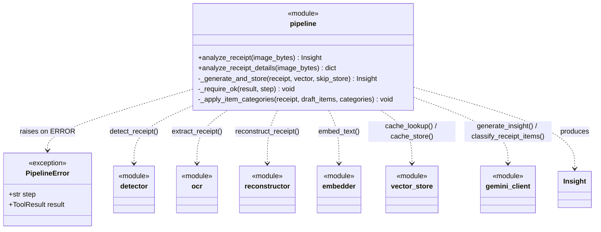

**Mô tả:**
- `analyze_receipt()` trả về `Insight` (Luồng 1 cơ bản); `analyze_receipt_details()` trả về `dict` giàu thông tin hơn cho UI (draft receipt, detected fields, suggested transaction, item categories).
- `_require_ok()` ném `PipelineError(step, result)` ngay khi một bước trả `status == ERROR`. Lỗi `cache_store` được xử lý mềm (soft-fail) — insight vẫn trả về.

---

### 4.5 Vision & OCR «modules» (`src/vision/`)

Ba module hàm thuần. Mỗi bước trả `ToolResult`; hai `@dataclass` nội bộ (`_ImageCandidate`, `_OCRLine`) là phần OOP duy nhất ở đây. **Đã dùng model thật** (YOLOv11 + VietOCR), tự suy giảm về fallback khi weights/thiết bị không sẵn sàng — không còn là stub thuần.

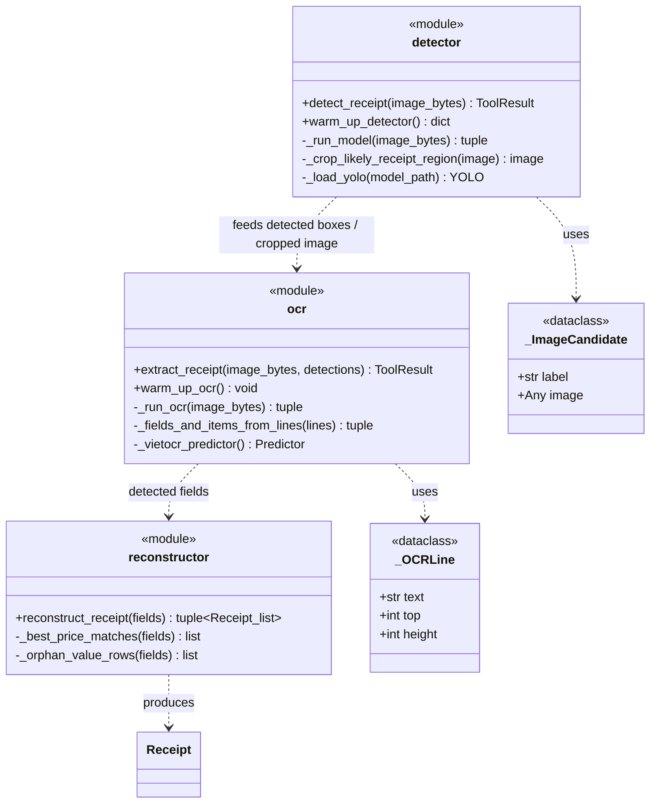

**Mô tả:**
- `detector.detect_receipt()` chạy YOLOv11 ([detector.py](../src/vision/detector.py)), phát hiện vùng/field hóa đơn và crop; `warm_up_detector()` được gọi lúc startup.
- `ocr.extract_receipt()` chạy VietOCR ([ocr.py](../src/vision/ocr.py)), đọc text từng box/line.
- `reconstructor.reconstruct_receipt()` ghép các field đã OCR (merchant, item, price, discount) thành `Receipt` + danh sách draft item theo vị trí hình học.

---

### 4.6 Embedding «module» (`src/embedding/embedder.py`)

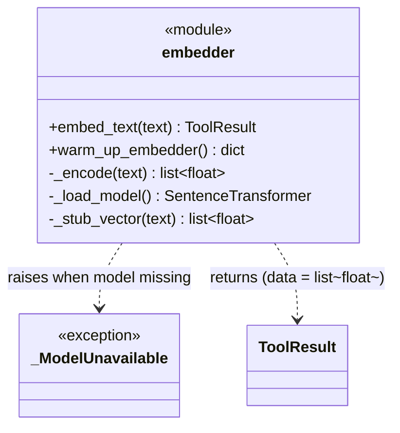

**Mô tả:**
- `embed_text()` dùng sentence-transformers (`all-MiniLM-L6-v2`, 384 chiều, L2-normalized) qua `_load_model()` được cache bằng `@lru_cache`.
- **Suy giảm có chủ đích:** nếu model không nạp được (`_ModelUnavailable`), trả `ToolResult.warning` kèm `_stub_vector()` (hash xác định) thay vì hard-fail — pipeline vẫn chạy được offline.
- `warm_up_embedder()` nạp sẵn weights lúc startup để lần lookup đầu không bị trễ.

---

### 4.7 Semantic Cache «module» (`src/cache/vector_store.py`)

Module bọc ChromaDB. Client/collection được tạo theo nhu cầu qua helper `_collection()` (không giữ state instance).

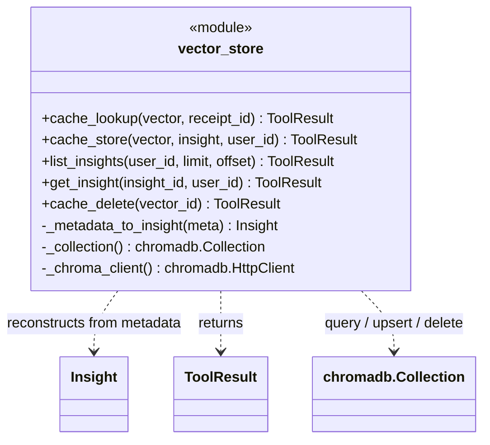

**Mô tả:**
- `cache_lookup()` query top-1 theo cosine distance; `similarity = 1 - distance`. Nếu `similarity ≥ similarity_threshold` (0.9, từ config) → trả cached `Insight` (`source=CACHE`), bỏ qua LLM.
- `cache_store()` `upsert` vector + metadata sau khi LLM sinh insight; trả `vector_id` mới sinh.
- `cache_delete()` gọi khi người dùng REJECT — xóa document để "unlearn".
- `get_insight()` kiểm tra quyền sở hữu qua `user_id` trong metadata (trả ERROR nếu khác chủ).
- `_metadata_to_insight()` dựng lại `Insight` từ metadata dict.

---

### 4.8 LLM «module» (`src/llm/gemini_client.py`)

Module bọc REST API của Google Generative AI (gọi trực tiếp bằng `httpx`, không qua SDK). Dùng JSON mode + `responseSchema`, có retry và fallback `NotImplementedError` khi thiếu `GEMINI_API_KEY`.

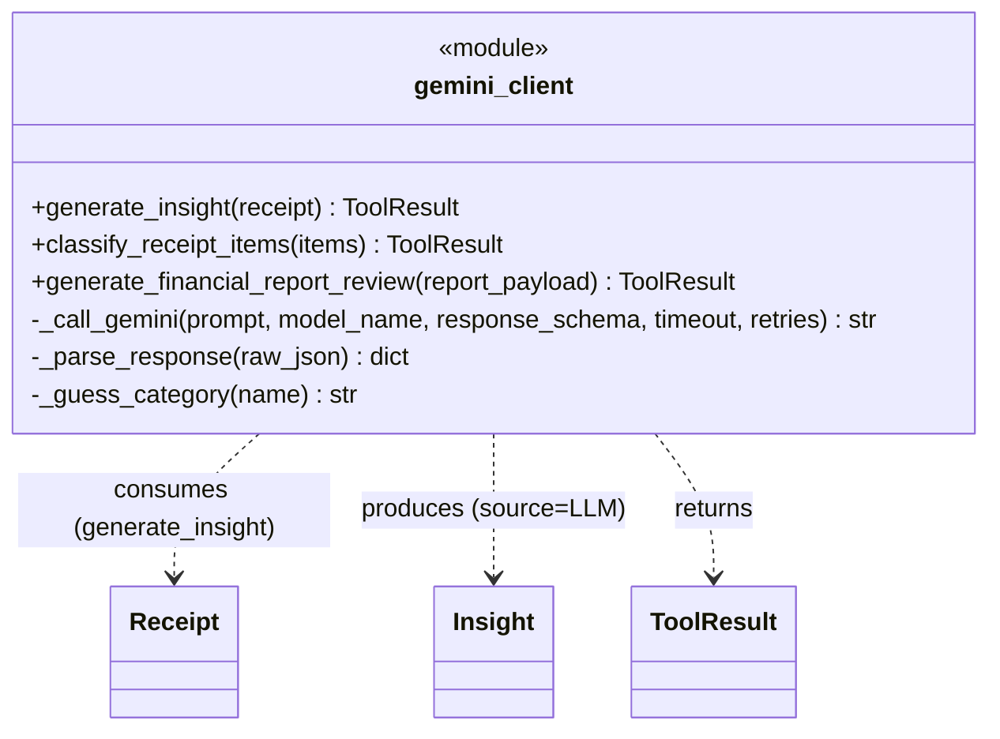

**Mô tả (đúng theo code):**
- `generate_insight(receipt)` → `Insight` (summary, category, tips) cho Luồng 1; thiếu API key → trả stub insight (`ToolResult.warning`).
- `classify_receipt_items(items)` → ánh xạ `item_id → category` (dùng model **Gemma** riêng + `responseSchema` enum); fallback `_guess_category()` theo từ khóa tiếng Việt khi LLM lỗi.
- `generate_financial_report_review(report_payload)` → nhận xét tài chính cá nhân hóa (summary/observations/suggested_actions) cho Luồng 5 (§4.12).
- `_call_gemini()` là helper dùng chung — **cũng được `stress_tester` gọi lại** (§4.10) cho phân tích hedging.
- Các method "planned" trong bản thiết kế cũ (`portfolio_recommendation`, `optimize_spending`, `summarize_report`) **không tồn tại**; chức năng tương ứng nằm ở `stress_tester` và `reports`.

---

### 4.9 Persistence — SQLAlchemy ORM (`src/db/models.py`, `src/db/base.py`)

Tầng lưu trữ là các ORM model thật (kế thừa `Base`), ánh xạ tới **8 bảng** PostgreSQL. Đây là lớp OOP cốt lõi của tầng dữ liệu quan hệ. (Chi tiết cột & ràng buộc xem §5.)

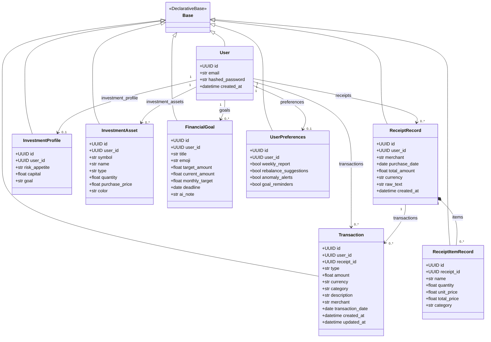

**Mô tả:**
- Mỗi class là một `Base` (DeclarativeBase) ORM với `Mapped[...]` columns và `relationship()` hai chiều (`back_populates`).
- `ReceiptRecord` / `ReceiptItemRecord` lưu hóa đơn đã phân tích; `Transaction.receipt_id` (nullable) liên kết giao dịch với hóa đơn nguồn.
- `InvestmentProfile` và `UserPreferences` là quan hệ **1–1** với `User` (`user_id` unique, `cascade="all, delete-orphan"`).
- Module `db/base.py` cung cấp `engine`, `AsyncSessionLocal`, dependency `get_db()`, và `ensure_database()` (auto `create_all` + lightweight migration thêm cột `receipt_items.category`).

---

### 4.10 Investment & Stress Test «modules» (`src/core/stress_tester.py`, `src/core/market_data.py`)

Module PA3 — theo dõi danh mục và stress-test vĩ mô. Đây là **module hàm**, vận hành trên ORM `InvestmentProfile` / `InvestmentAsset` (§4.9) và DTO `StressTestResponse` (§4.3). Route `/investment` lắp ráp dữ liệu rồi gọi các hàm này.

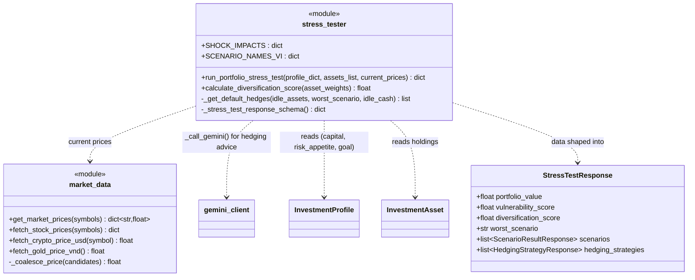

**Mô tả:**
- `run_portfolio_stress_test()` định giá danh mục theo giá thị trường thật, chạy 4 kịch bản shock (`SHOCK_IMPACTS`: lạm phát / sụp đổ công nghệ / suy thoái / khủng hoảng crypto), tính `vulnerability_score` và `diversification_score` (Simpson Index), rồi gọi Gemini sinh `overall_analysis` + `hedging_strategies` (có fallback tĩnh `_get_default_hedges`).
- `market_data.get_market_prices()` định tuyến theo loại symbol: cổ phiếu VN (`vnstock`), crypto (Binance, quy đổi USD→VND), vàng SJC; `_coalesce_price()` lọc `NaN` để không bỏ qua fallback.

---

### 4.11 Market Intelligence «modules» (`src/services/`)

Hai service module cung cấp dữ liệu thị trường thời gian thực cho route `/market` (và bối cảnh cho PA3). Đều là hàm thuần + cache trong-process (`_get_cached`/`_set_cached`), sản sinh DTO `MarketSymbolResponse` / `MarketIntelligenceResponse`.

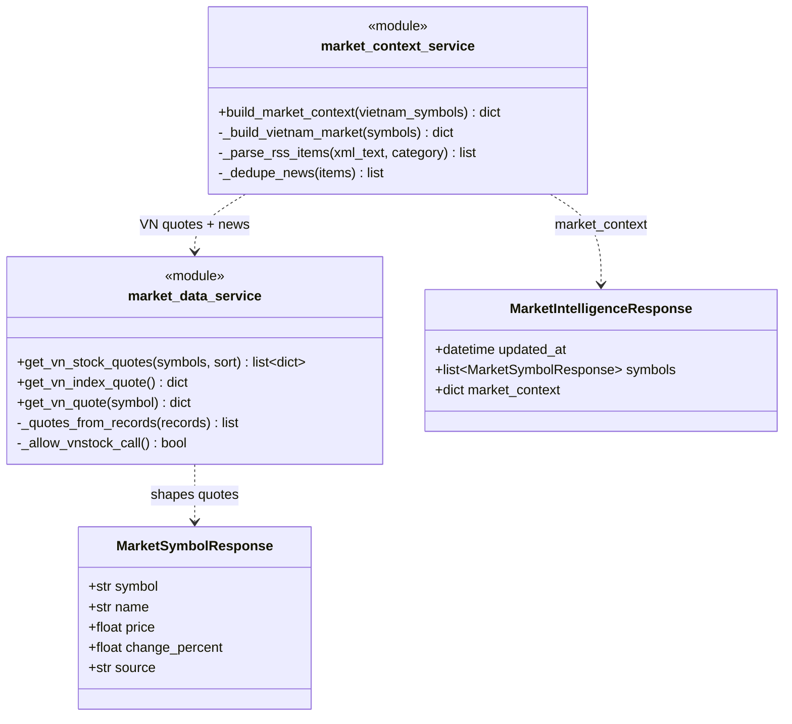

**Mô tả:**
- `market_data_service` lấy giá cổ phiếu/chỉ số VN (qua `vnstock`, có throttle `_allow_vnstock_call` + cache); chuẩn hóa record thành quote dict, có `_error_quote` khi nguồn lỗi.
- `market_context_service.build_market_context()` tổng hợp thị trường VN + tin tức RSS (parse, dedupe) thành `market_context` cho dashboard.

---

### 4.12 Reporting «module» (`src/api/routes/reports.py`)

Báo cáo tài chính được **tính on-demand** (không lưu bảng `reports`/`charts`). Route `GET /reports/summary` đọc dữ liệu, tổng hợp trong-bộ-nhớ, gọi LLM sinh nhận xét, rồi trả `FinancialReportResponse`.

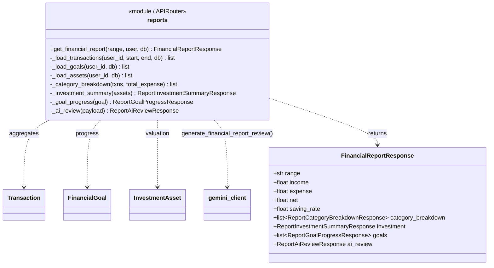

**Mô tả:**
- Aggregate giao dịch theo `range` (income/expense/net/saving_rate, phân bổ danh mục, giao dịch lớn nhất), tóm tắt đầu tư & tiến độ mục tiêu.
- `_ai_review()` gọi `gemini_client.generate_financial_report_review()`; khi LLM không sẵn sàng dùng `_fallback_summary/observations/actions` (đánh dấu `source="fallback"`).
- Biểu đồ do Presentation Layer render từ `category_breakdown` — backend chỉ trả số liệu, không sinh metadata chart riêng.

---

### 4.13 Authentication (`src/auth/`, `src/db/models.py`)

Auth gồm hai module hàm (`service`, `dependencies`) + một `@dataclass` (`AuthenticatedUser`, dùng làm fallback khi DB offline) + ORM `User`.

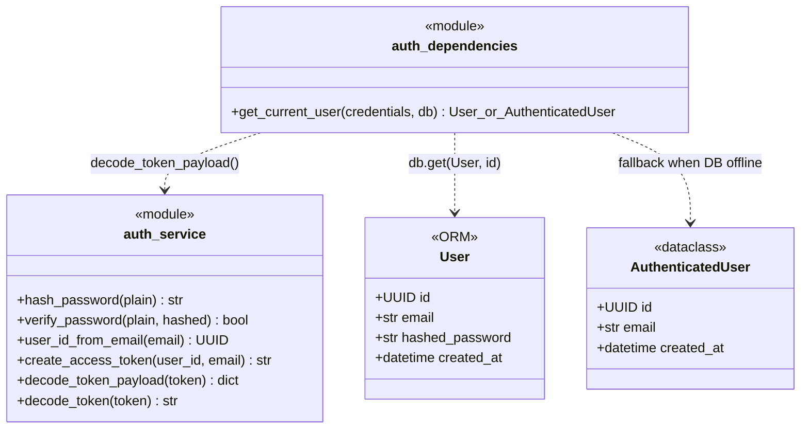

**Mô tả:**
- `auth_service` dùng `passlib`/bcrypt để hash & verify; JWT ký/giải bằng `PyJWT` (HS256). `user_id_from_email()` sinh UUID xác định (uuid5) để hỗ trợ Google login.
- `get_current_user()` là FastAPI dependency: giải JWT → `db.get(User)`. Nếu DB không reachable, trả `AuthenticatedUser` dựng từ claim trong token (degrade graceful) thay vì 500.

---

### 4.14 API Routing Layer (`main.py`, `src/api/routes/`)

Tầng giao tiếp là các `APIRouter` của FastAPI (mỗi file một router, mỗi endpoint là một `async def`). `create_app()` trong `main.py` mount **10 router** và cấu hình CORS + lifespan (warm-up YOLO/VietOCR/Embedding lúc startup).

| Router (prefix) | Endpoint chính | Trả về |
|---|---|---|
| `auth` (`/auth`) | `POST /register`, `POST /login`, `POST /google`, `GET /me` | `AuthResponse` / `UserResponse` |
| `receipts` (`/receipts`) | `POST /analyze` (UploadFile) | `AnalyzeResponse` |
| `transactions` (`/transactions`) | `POST`, `PATCH /{id}`, `GET` | `TransactionResponse` / `TransactionListResponse` |
| `feedback` (`/feedback`) | `POST /{insight_id}` | `FeedbackResponse` |
| `insights` (—) | `GET /health`, `GET /insights`, `GET /insights/{id}` | `InsightListResponse` / `InsightResponse` |
| `investment` (`/investment`) | `GET/POST /profile`, `GET/POST /portfolio`, `DELETE /portfolio/{id}`, `GET /stress-test` | `Investment*Response` / `StressTestResponse` |
| `goals` (`/goals`) | `GET`, `POST`, `PATCH /{id}`, `DELETE /{id}` | `GoalResponse` / `GoalListResponse` |
| `preferences` (`/preferences`) | `GET`, `PUT` | `PreferencesResponse` |
| `reports` (`/reports`) | `GET /summary` | `FinancialReportResponse` |
| `market` (`/market`) | `GET /vn-stocks`, `GET /vn-index`, `GET /overview` | `MarketSymbolResponse` / `MarketIntelligenceResponse` |

**Mô tả:**
- Mọi route (trừ auth & health) inject `get_current_user` qua `Depends()` để xác thực JWT.
- Router là instance `APIRouter` (object) nhưng handler là hàm — không có "class Router" tự định nghĩa.

---

## 5. Database Design — Thiết kế Cơ sở dữ liệu

### 5.1 Entity Relationship Diagram (PostgreSQL)

SpendSense AI dùng PostgreSQL cho dữ liệu quan hệ (**8 bảng**, ánh xạ 1–1 với ORM model ở §4.9) và ChromaDB cho vector cache (§5.2). Schema được tạo qua `Base.metadata.create_all` + lightweight migration trong `ensure_database()`.

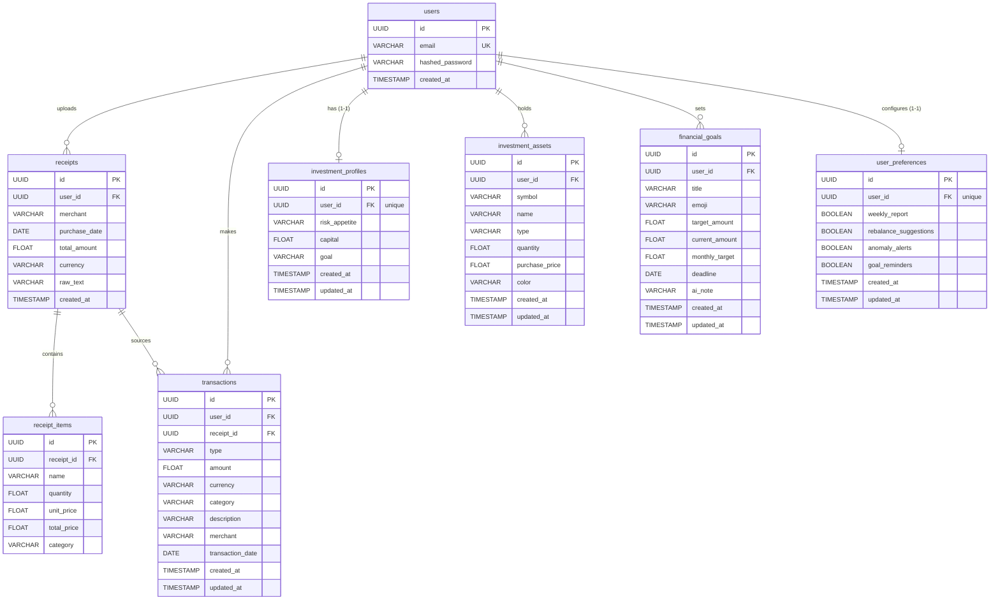

> **Lưu ý kiểu dữ liệu:** ORM hiện dùng `Float` cho số tiền (không phải `DECIMAL`) và lưu enum dạng `VARCHAR` (vd `transactions.type` = `expense|income`, `investment_assets.type` = `stock|gold|saving|crypto`). Chưa có bảng `wallets`, `alerts`, `risk_profiles`, `investment_recommendations`, `reports`, `charts` — các chức năng tương ứng hiện tính on-demand hoặc chưa triển khai.

---

### 5.2 ChromaDB Vector Collection

ChromaDB lưu insight dưới dạng **document** gồm ba phần: ID, Embedding, Metadata.

| Trường metadata | Kiểu | Mô tả |
|-----------------|------|-------|
| `insight_id` | str (UUID) | ID của `Insight` (dùng dựng lại object khi cache hit) |
| `receipt_id` | str (UUID) | ID của `Receipt` đã phân tích |
| `summary` | str | Tóm tắt chi tiêu do AI tạo |
| `category` | str | Danh mục (an-uong, di-chuyen, mua-sam...) |
| `tips` | str (JSON array) | Danh sách gợi ý tiết kiệm |
| `vector_id` | str (UUID) | ID document trong ChromaDB (dùng để `cache_delete` khi REJECT) |
| `user_id` | str (UUID) | Liên kết với `users.id` — lọc insight theo người dùng |

> **Lưu ý:** `source` không được lưu trong metadata — khi cache hit, `source` được gán cứng `CACHE` lúc dựng lại `Insight`. Collection cấu hình `hnsw:space = "cosine"`.

**Embedding:** vector 384 chiều (float32, L2-normalized) từ sentence-transformers `all-MiniLM-L6-v2`.

**Semantic Cache:** `similarity = 1 - cosine_distance`; nếu ≥ `similarity_threshold` (0.9) → trả về cached insight, bỏ qua LLM (tiết kiệm ~80% chi phí API).

**Unlearning:** REJECT → `cache_delete(vector_id)` xóa document khỏi collection.

---

### 5.3 Mô tả các Bảng PostgreSQL

#### Bảng `users`

| Cột | Kiểu | Ràng buộc | Mô tả |
|-----|------|-----------|-------|
| `id` | UUID | PK | Khóa chính (`uuid4`) |
| `email` | VARCHAR(255) | UNIQUE, NOT NULL | Email đăng nhập |
| `hashed_password` | VARCHAR(255) | NOT NULL | Mật khẩu băm bcrypt |
| `created_at` | TIMESTAMP | DEFAULT utcnow | Thời điểm tạo tài khoản |

#### Bảng `receipts`

| Cột | Kiểu | Mô tả |
|-----|------|-------|
| `id` | UUID PK | Khóa chính |
| `user_id` | UUID FK → users | Chủ hóa đơn |
| `merchant` | VARCHAR(255) | Tên cửa hàng |
| `purchase_date` | DATE (nullable) | Ngày mua |
| `total_amount` | FLOAT | Tổng tiền |
| `currency` | VARCHAR(8) | Đơn vị tiền (mặc định VND) |
| `raw_text` | VARCHAR(4000) | Text thô từ OCR |
| `created_at` | TIMESTAMP | Thời điểm lưu |

#### Bảng `receipt_items`

| Cột | Kiểu | Mô tả |
|-----|------|-------|
| `id` | UUID PK | Khóa chính |
| `receipt_id` | UUID FK → receipts | Hóa đơn chứa item (cascade delete) |
| `name` | VARCHAR(500) | Tên mặt hàng |
| `quantity` | FLOAT | Số lượng |
| `unit_price` | FLOAT | Đơn giá |
| `total_price` | FLOAT | Thành tiền |
| `category` | VARCHAR(80) | Danh mục item (Gemma phân loại; mặc định `khac`) |

#### Bảng `transactions`

| Cột | Kiểu | Mô tả |
|-----|------|-------|
| `id` | UUID PK | Khóa chính |
| `user_id` | UUID FK → users | Người thực hiện giao dịch |
| `receipt_id` | UUID FK → receipts (nullable) | Hóa đơn nguồn (nếu tạo từ Luồng 1) |
| `type` | VARCHAR(16) | `expense` / `income` |
| `amount` | FLOAT | Số tiền |
| `currency` | VARCHAR(8) | Đơn vị tiền |
| `category` | VARCHAR(80) | Danh mục chi tiêu |
| `description` | VARCHAR(500) | Mô tả giao dịch |
| `merchant` | VARCHAR(255) | Tên cửa hàng |
| `transaction_date` | DATE (nullable) | Ngày giao dịch |
| `created_at` / `updated_at` | TIMESTAMP | Thời điểm tạo / cập nhật |

#### Bảng `investment_profiles` (1–1 với `users`)

| Cột | Kiểu | Mô tả |
|-----|------|-------|
| `id` | UUID PK | Khóa chính |
| `user_id` | UUID FK → users, UNIQUE | Chủ hồ sơ đầu tư |
| `risk_appetite` | VARCHAR(50) | conservative / moderate / aggressive |
| `capital` | FLOAT | Tổng vốn đầu tư (VND) |
| `goal` | VARCHAR(500) | Mục tiêu đầu tư (text tự do) |
| `created_at` / `updated_at` | TIMESTAMP | Thời điểm tạo / cập nhật |

#### Bảng `investment_assets`

| Cột | Kiểu | Mô tả |
|-----|------|-------|
| `id` | UUID PK | Khóa chính |
| `user_id` | UUID FK → users | Chủ tài sản (cascade delete) |
| `symbol` | VARCHAR(50) | Mã (FPT, BTC, GOLD...) |
| `name` | VARCHAR(255) | Tên hiển thị |
| `type` | VARCHAR(50) | stock / gold / saving / crypto |
| `quantity` | FLOAT | Số lượng nắm giữ |
| `purchase_price` | FLOAT | Giá mua (VND) |
| `color` | VARCHAR(20) | Màu hiển thị biểu đồ |
| `created_at` / `updated_at` | TIMESTAMP | Thời điểm tạo / cập nhật |

#### Bảng `financial_goals`

| Cột | Kiểu | Mô tả |
|-----|------|-------|
| `id` | UUID PK | Khóa chính |
| `user_id` | UUID FK → users | Chủ mục tiêu (cascade delete) |
| `title` | VARCHAR(255) | Tên mục tiêu |
| `emoji` | VARCHAR(16) | Biểu tượng (mặc định 🎯) |
| `target_amount` | FLOAT | Số tiền mục tiêu |
| `current_amount` | FLOAT | Số tiền đã tích lũy |
| `monthly_target` | FLOAT | Mức tích lũy mục tiêu/tháng |
| `deadline` | DATE (nullable) | Hạn chót |
| `ai_note` | VARCHAR(1000) | Ghi chú do AI tạo |
| `created_at` / `updated_at` | TIMESTAMP | Thời điểm tạo / cập nhật |

> `status` (achieved/on-track/at-risk) và `progress_percent` **không lưu DB** — được tính ở `GoalResponse.from_goal()` (§4.3).

#### Bảng `user_preferences` (1–1 với `users`)

| Cột | Kiểu | Mô tả |
|-----|------|-------|
| `id` | UUID PK | Khóa chính |
| `user_id` | UUID FK → users, UNIQUE | Chủ cấu hình |
| `weekly_report` | BOOLEAN | Bật báo cáo tuần (mặc định true) |
| `rebalance_suggestions` | BOOLEAN | Gợi ý tái cân bằng danh mục (mặc định false) |
| `anomaly_alerts` | BOOLEAN | Cảnh báo chi tiêu bất thường (mặc định true) |
| `goal_reminders` | BOOLEAN | Nhắc tiến độ mục tiêu (mặc định true) |
| `created_at` / `updated_at` | TIMESTAMP | Thời điểm tạo / cập nhật |

---

## 6. Luồng Xử lý Chính (Key Sequences)

### 6.1 Phân tích Hóa đơn (POST /receipts/analyze) — Luồng 1

```
Client → POST /receipts/analyze (image file)
    │
    ▼
[Auth Dependency] → validate JWT → resolve User
    │
    ▼
[pipeline.analyze_receipt_details(image_bytes)]
    │
    ├─[1] detector.detect_receipt()            → ToolResult {detections, cropped}
    ├─[2] ocr.extract_receipt()                → ToolResult {fields}
    ├─[3] reconstructor.reconstruct_receipt()  → Receipt + draft items
    ├─[4] embedder.embed_text(canonical_text)  → ToolResult {vector[384]}
    ├─[5] vector_store.cache_lookup(vector)
    │       ├─ HIT (sim ≥ 0.9) → return Insight (source=CACHE)
    │       └─ MISS
    │             ├─[6a] gemini_client.generate_insight(Receipt)
    │             ├─[6b] gemini_client.classify_receipt_items(items)
    │             └─[6c] vector_store.cache_store(vector, Insight)  (soft-fail)
    │
    ▼
[API] serialize → AnalyzeResponse → 200 OK
```

> Hàm cũ `analyze_receipt()` (chỉ trả `Insight`) vẫn tồn tại; route `/receipts/analyze` dùng `analyze_receipt_details()` để trả thêm draft receipt + detected fields + suggested transaction cho UI.

### 6.2 Feedback / Unlearning (POST /feedback/{insight_id})

```
Client → POST /feedback/{insight_id} {action: CONFIRM|REJECT, vector_id}
    │
    ▼
[Auth Dependency] → validate JWT
    │
    ├─ CONFIRM → no-op (vector giữ lại trong ChromaDB)
    └─ REJECT  → vector_store.cache_delete(vector_id) → xóa khỏi ChromaDB
    │
    ▼
FeedbackResponse {message} → 200 OK
```

### 6.3 Tạo Giao dịch — Luồng 2 (Implemented)

```
Client → POST /transactions {type, amount, category, receipt_id?, receipt_items?}
    │
    ▼
[Auth Dependency] → validate JWT
    │
    ▼
[transactions router handler]
    │
    ├── INSERT INTO transactions
    └── (nếu có receipt_items) INSERT receipts + receipt_items
    │
    ▼
TransactionResponse → 201 Created
```

> Không có cập nhật "số dư ví" — code hiện không có khái niệm `wallet`. Mục tiêu (`financial_goals`) được cập nhật qua route `/goals` riêng; `progress` tính khi đọc (`GoalResponse.from_goal`).

### 6.4 Báo cáo Tài chính — Luồng 5 (Implemented, on-demand)

```
Client → GET /reports/summary?range=...
    │
    ▼
[Auth Dependency] → validate JWT
    │
    ▼
[reports.get_financial_report(range, user, db)]
    │
    ├── _load_transactions / _load_goals / _load_assets  (SELECT theo user + range)
    ├── _category_breakdown / _investment_summary / _goal_progress  (aggregate in-memory)
    ├── gemini_client.generate_financial_report_review(payload) → ai_review
    │        (fallback _fallback_* nếu LLM không sẵn sàng)
    │
    ▼
FinancialReportResponse (số liệu + ai_review) → 200 OK   (KHÔNG ghi DB)
```

---

## 7. Quyết định Kiến trúc Quan trọng

| Quyết định | Lý do |
|---|---|
| ToolResult contract cho mọi bước pipeline | Xử lý lỗi nhất quán, dễ debug từng bước mà không cần try/except lồng nhau |
| Async FastAPI + asyncpg | Không block thread khi chờ DB / LLM, phù hợp với workload I/O-heavy |
| Pydantic cho mọi model | Tự động validate, serialize/deserialize, type safety |
| ChromaDB cho semantic cache | Cosine similarity search sub-millisecond, không cần viết ranking algorithm |
| Stub fallback cho AI model | Pipeline không hard-fail khi weights/API chưa sẵn sàng (CV/OCR/Embedding/LLM đều có nhánh fallback xác định) — vẫn dev/test được offline |
| Tầng xử lý bằng module hàm (không OOP) | Hàm không-state trả `ToolResult` — idiomatic Python, dễ test/monkeypatch, tránh "class giả"; OOP chỉ dùng cho tầng dữ liệu (Pydantic/ORM) |
| JWT stateless auth (+ offline fallback) | Không cần session store; khi DB offline vẫn dựng `AuthenticatedUser` từ claim |
| Gemini 2.5 Flash + Gemma cho LLM tasks | Flash cho insight/report, Gemma cho phân loại item — balance chất lượng/chi phí; JSON mode + `responseSchema` |
| Báo cáo tính on-demand (không lưu reports/charts) | Tránh bảng phụ và đồng bộ stale; frontend render biểu đồ từ số liệu trả về |
| Semantic cache trước LLM | Giảm ~80% LLM API calls — tiết kiệm chi phí và giảm latency |
