# Software Architecture Document — SpendSense AI

---

## 1. Logical View — Kiến trúc Tổng thể

SpendSense AI được xây dựng theo kiến trúc **3 tầng** kết hợp với mô hình **5 luồng xử lý dữ liệu**.

### Tầng 1 — Presentation (Giao diện người dùng)

Là ứng dụng Web (React) mà người dùng trực tiếp tương tác. Tầng này chịu trách nhiệm:
- Hiển thị danh sách insight, biểu đồ thống kê và báo cáo chi tiêu.
- Nhận ảnh hóa đơn từ camera hoặc thư viện ảnh.
- Gửi feedback (xác nhận / từ chối) cho từng insight.
- Hiển thị số dư ví, lịch sử giao dịch, mục tiêu tài chính.
- Tầng này **không chứa logic nghiệp vụ**.

### Tầng 2 — Application (Xử lý nghiệp vụ)

Đây là phần lõi của hệ thống, toàn bộ logic nghiệp vụ diễn ra ở đây. Tầng này xử lý 5 luồng dữ liệu song song:

| Luồng | Tên | Mô tả tóm tắt |
|-------|-----|----------------|
| **Luồng 1** | Data Ingestion | Chụp hóa đơn → OCR → Embedding → Semantic Cache → LLM Insight |
| **Luồng 2** | Cash Flow | Quản lý ví, giao dịch, số dư, mục tiêu tài chính |
| **Luồng 3** | Investment Advisor | Phân tích danh mục đầu tư, đề xuất chiến lược theo hồ sơ rủi ro |
| **Luồng 4** | Resource Optimization | Phân tích chi tiêu bất thường, tối ưu ngân sách, gửi cảnh báo |
| **Luồng 5** | Reporting | Tổng hợp báo cáo, biểu đồ, thông báo định kỳ |

### Tầng 3 — Data (Lưu trữ dữ liệu)

Gồm hai kho lưu trữ chính:
- **PostgreSQL** (Relational Store): lưu người dùng, giao dịch, ví, mục tiêu, danh mục đầu tư, báo cáo.
- **ChromaDB** (Vector DB): lưu embedding hóa đơn và insight đã sinh, phục vụ Semantic Cache cho Luồng 1.

Tầng này **chỉ được truy cập bởi Tầng 2**, không bao giờ trực tiếp từ Tầng 1.

---

## 2. Luồng Dữ liệu Chi tiết

### Luồng 1 — Data Ingestion (Phân tích Hóa đơn)

```
Receipt Image (upload)
       │
       ▼
[YOLOv11 Detector]  ──────── phát hiện và crop vùng hóa đơn
       │
       ▼
[VietOCR Extractor] ───────── trích xuất text → Receipt object
       │
       ▼
[Sentence-Transformer Embedder] ── chuyển canonical_text → vector 384 chiều
       │
       ▼
[ChromaDB VectorStore — cache_lookup]
       │
       ├── similarity ≥ 0.9 ──► trả về Insight (source=CACHE) ─► API Response
       │
       └── similarity < 0.9
              │
              ▼
       [Gemini 2.5 Flash] ── generate_insight(Receipt) → Insight (source=LLM)
              │
              ▼
       [ChromaDB — cache_store] ── lưu vector + metadata
              │
              ▼
           API Response

Feedback:
  CONFIRM → vector giữ lại trong ChromaDB
  REJECT  → cache_delete(vector_id) → xóa khỏi ChromaDB (unlearning)
```

### Luồng 2 — Cash Flow (Quản lý Dòng tiền)

```
User Input (giao dịch / số dư ví)
       │
       ▼
[CashFlowService]
       │
       ├── Tạo / cập nhật Transaction
       ├── Cập nhật số dư Wallet
       ├── Kiểm tra Goal progress
       │
       ▼
[PostgreSQL]
  ├── bảng wallets   (số dư hiện tại)
  ├── bảng transactions (lịch sử giao dịch)
  └── bảng goals    (mục tiêu tiết kiệm)
       │
       ▼
Dashboard / Notification
```

### Luồng 3 — Investment Advisor (Tư vấn Đầu tư)

```
User Risk Profile Input
       │
       ▼
[InvestmentAdvisorService]
       │
       ├── Đọc risk_profiles (tolerance, horizon, liquidity_need)
       ├── Query historical transactions → tính disposable income
       │
       ▼
[Gemini 2.5 Flash — portfolio_recommendation(profile, spending)]
       │
       ▼
[PostgreSQL — investment_recommendations]
       │
       ▼
Recommendation Response (asset allocation, fund suggestions)
```

### Luồng 4 — Resource Optimization (Tối ưu Nguồn lực)

```
Scheduled Job / Trigger
       │
       ▼
[OptimizationService]
       │
       ├── Phân tích patterns từ transactions (N ngày gần nhất)
       ├── Phát hiện chi tiêu bất thường (anomaly detection)
       ├── So sánh với goals → tính budget gap
       │
       ▼
[Gemini 2.5 Flash — optimize_spending(patterns)]
       │
       ├── Tạo Alert nếu vượt ngưỡng
       └── Lưu vào PostgreSQL — alerts
              │
              ▼
       Push Notification / Email Alert → User
```

### Luồng 5 — Reporting (Báo cáo & Thông báo)

```
Scheduled / On-demand Request
       │
       ▼
[ReportingService]
       │
       ├── Tổng hợp dữ liệu từ transactions, wallets, goals
       ├── Gọi [Gemini 2.5 Flash — summarize_report(data)]
       ├── Tạo bảng biểu đồ (chart metadata)
       │
       ▼
[PostgreSQL]
  ├── bảng reports (báo cáo tổng hợp)
  └── bảng charts  (metadata biểu đồ)
       │
       ▼
Report Response (PDF / JSON) → Presentation Layer
```

---

## 3. Danh sách Component

| Component | Lớp triển khai | Luồng | Trạng thái | Vai trò |
|---|---|---|---|---|
| **Backend API** | `main.py`, `src/api/routes/` | Tất cả | ✅ Implemented | FastAPI entrypoint, định tuyến request |
| **Auth Module** | `src/auth/` | Tất cả | ✅ Implemented | JWT, bcrypt, dependency injection |
| **CV & OCR Module** | `src/vision/` | Luồng 1 | ✅ Stub | YOLOv11 detect, VietOCR extract |
| **Embedding Module** | `src/embedding/` | Luồng 1 | ✅ Stub | sentence-transformers → vector 384 chiều |
| **Semantic Cache** | `src/cache/` | Luồng 1 | ✅ Implemented | ChromaDB lookup/store/delete |
| **LLM Module** | `src/llm/` | Luồng 1, 3, 4, 5 | ✅ Implemented | Gemini 2.5 Flash — insight, portfolio, report |
| **Pipeline Orchestrator** | `src/pipeline.py` | Luồng 1 | ✅ Implemented | Điều phối 5 bước xử lý hóa đơn |
| **Domain Models** | `src/models/` | Tất cả | ✅ Implemented | Pydantic models: Receipt, Insight, Transaction |
| **Database Layer** | `src/db/` | Tất cả | ✅ Implemented | SQLAlchemy async, PostgreSQL |
| **Cash Flow Service** | `src/services/cashflow.py` | Luồng 2 | 🔧 Planned | Quản lý ví, giao dịch, mục tiêu |
| **Investment Advisor** | `src/services/investment.py` | Luồng 3 | 🔧 Planned | Đề xuất danh mục theo hồ sơ rủi ro |
| **Optimization Service** | `src/services/optimization.py` | Luồng 4 | 🔧 Planned | Phân tích anomaly, tạo cảnh báo |
| **Reporting Service** | `src/services/reporting.py` | Luồng 5 | 🔧 Planned | Tổng hợp báo cáo, biểu đồ |

> **Ghi chú:** ✅ Implemented = đã triển khai trong codebase hiện tại. ✅ Stub = khung code đầy đủ nhưng AI model chưa thực. 🔧 Planned = chưa triển khai, dự kiến cho các sprint tiếp theo.

---

### 3.1 Backend API

| Mục | Nội dung |
|-----|----------|
| **Lớp triển khai** | `main.py`, `src/api/routes/auth.py`, `src/api/routes/receipts.py`, `src/api/routes/feedback.py`, `src/api/routes/insights.py`, `src/api/schemas.py` |
| **Trách nhiệm** | Là điểm vào duy nhất của hệ thống. Tiếp nhận HTTP request, validate input qua Pydantic schema, điều hướng đến handler phù hợp, serialize kết quả thành JSON response. Quản lý lifespan (khởi tạo DB pool, ChromaDB client khi startup, giải phóng khi shutdown). |
| **Kết nối đến component khác** | → **Auth Module**: inject `get_current_user` dependency vào mọi route cần xác thực. → **Pipeline Orchestrator**: `ReceiptsRouter` gọi `Pipeline.analyze_receipt()` để xử lý hóa đơn. → **Semantic Cache**: `FeedbackRouter` gọi `VectorStore.cache_delete()` khi REJECT; `InsightsRouter` gọi `VectorStore.list_insights()` / `get_insight()`. → **Domain Models**: dùng Pydantic schema `*Request` / `*Response` để validate và serialize. |

---

### 3.2 Auth Module

| Mục | Nội dung |
|-----|----------|
| **Lớp triển khai** | `src/auth/service.py`, `src/auth/dependencies.py` |
| **Trách nhiệm** | Hash và verify mật khẩu bằng bcrypt. Tạo và decode JWT access token (PyJWT). Cung cấp FastAPI dependency `get_current_user` — decode token, query DB lấy `User`, trả về cho handler. Là cổng kiểm soát quyền truy cập của toàn hệ thống. |
| **Kết nối đến component khác** | → **Database Layer**: query bảng `users` để xác minh email tồn tại khi đăng ký / lấy `User` object khi decode token. ← **Backend API**: được inject vào tất cả route có bảo vệ thông qua FastAPI `Depends()`. |

---

### 3.3 CV & OCR Module

| Mục | Nội dung |
|-----|----------|
| **Lớp triển khai** | `src/vision/detector.py` (YOLOv11), `src/vision/ocr.py` (VietOCR) |
| **Trách nhiệm** | `VisionDetector`: nhận ảnh gốc, dùng YOLOv11 phát hiện bounding box của hóa đơn, cắt (crop) vùng đó ra. `OCRExtractor`: nhận ảnh đã crop, dùng VietOCR trích xuất text thô, parse các dòng để xác định merchant, ngày mua, danh sách mặt hàng, tổng tiền — trả về `Receipt` có cấu trúc. Cả hai hiện là stub (deterministic mock). |
| **Kết nối đến component khác** | ← **Pipeline Orchestrator**: bước 1 (`detect_receipt`) và bước 2 (`extract_receipt`) trong chuỗi Luồng 1. → **Domain Models**: `OCRExtractor` tạo ra `Receipt` và danh sách `ReceiptItem`. Đầu ra (`ToolResult.data["receipt"]`) được chuyển tiếp sang `Embedder`. |

---

### 3.4 Embedding Module

| Mục | Nội dung |
|-----|----------|
| **Lớp triển khai** | `src/embedding/embedder.py` |
| **Trách nhiệm** | Nhận chuỗi văn bản chuẩn hóa từ `Receipt.canonical_text()`, dùng model `all-MiniLM-L6-v2` (sentence-transformers) để chuyển thành vector float32 384 chiều. Đảm bảo tính nhất quán của vector — cùng nội dung hóa đơn luôn cho cùng một vector để cache lookup hoạt động đúng. Hiện là stub trả về vector giả định (deterministic hash). |
| **Kết nối đến component khác** | ← **Pipeline Orchestrator**: bước 3 (`embed_text`) trong Luồng 1, nhận `Receipt` từ OCR. → **Semantic Cache**: cung cấp vector 384 chiều cho `VectorStore.cache_lookup()` (tìm kiếm) và `VectorStore.cache_store()` (lưu sau khi LLM sinh insight). |

---

### 3.5 Semantic Cache

| Mục | Nội dung |
|-----|----------|
| **Lớp triển khai** | `src/cache/vector_store.py` |
| **Trách nhiệm** | Bọc ChromaDB client, quản lý collection vector insight. `cache_lookup()`: tính cosine similarity giữa vector mới và toàn collection — nếu max ≥ 0.9 thì trả về cached `Insight` ngay, không gọi LLM. `cache_store()`: lưu vector + metadata sau khi LLM sinh xong. `cache_delete()`: xóa document (unlearning) khi người dùng REJECT. `list_insights()` / `get_insight()`: truy vấn lịch sử insight theo `user_id`. |
| **Kết nối đến component khác** | ← **Pipeline Orchestrator**: gọi `cache_lookup` (bước 4) và `cache_store` (bước 5b) trong Luồng 1. ← **Backend API** (`FeedbackRouter`): gọi `cache_delete(vector_id)` khi người dùng REJECT. ← **Backend API** (`InsightsRouter`): gọi `list_insights` và `get_insight` để trả về lịch sử. → **ChromaDB** (Vector DB): thao tác trực tiếp qua `chromadb.Client` — add, query, delete document. |

---

### 3.6 LLM Module

| Mục | Nội dung |
|-----|----------|
| **Lớp triển khai** | `src/llm/gemini_client.py` |
| **Trách nhiệm** | Bọc Google Generative AI SDK. Cung cấp 4 phương thức tương ứng 4 luồng: `generate_insight()` (Luồng 1), `portfolio_recommendation()` (Luồng 3), `optimize_spending()` (Luồng 4), `summarize_report()` (Luồng 5). Xây dựng prompt tối ưu, gọi Gemini 2.5 Flash, parse JSON response, xử lý lỗi (retry, parse failure). Luôn trả về `ToolResult`. |
| **Kết nối đến component khác** | ← **Pipeline Orchestrator**: gọi `generate_insight(receipt)` khi cache miss (Luồng 1). ← **Investment Advisor Service**: gọi `portfolio_recommendation(profile, spending)` (Luồng 3, planned). ← **Optimization Service**: gọi `optimize_spending(patterns)` (Luồng 4, planned). ← **Reporting Service**: gọi `summarize_report(data)` (Luồng 5, planned). → **Gemini API** (external): gửi HTTP request đến `generativelanguage.googleapis.com`. |

---

### 3.7 Pipeline Orchestrator

| Mục | Nội dung |
|-----|----------|
| **Lớp triển khai** | `src/pipeline.py`, `src/core/tool_result.py` |
| **Trách nhiệm** | Điều phối toàn bộ 5 bước của Luồng 1 theo thứ tự: Detect → OCR → Embed → Cache Lookup → (LLM + Cache Store). Enforce `ToolResult` contract — mỗi bước phải trả về `ToolResult`; nếu `status == ERROR` thì ném `PipelineError` ngay lập tức (fail-fast). Xử lý mềm (soft-fail) khi `cache_store` thất bại — insight vẫn được trả về dù không lưu được vào cache. |
| **Kết nối đến component khác** | ← **Backend API** (`ReceiptsRouter`): nhận `image_bytes` từ upload request. → **CV & OCR Module**: gọi `VisionDetector.detect_receipt()` và `OCRExtractor.extract_receipt()`. → **Embedding Module**: gọi `Embedder.embed_text()`. → **Semantic Cache**: gọi `VectorStore.cache_lookup()` và `cache_store()`. → **LLM Module**: gọi `GeminiClient.generate_insight()` khi cache miss. |

---

### 3.8 Domain Models

| Mục | Nội dung |
|-----|----------|
| **Lớp triển khai** | `src/models/expense.py` |
| **Trách nhiệm** | Định nghĩa tất cả data contract trung tâm của hệ thống dưới dạng Pydantic BaseModel (immutable): `Receipt`, `ReceiptItem`, `Insight`, `FeedbackAction`, `InsightSource`. Cung cấp `Receipt.canonical_text()` — phương thức chuẩn hóa nội dung hóa đơn thành chuỗi nhất quán dùng cho embedding. Tự động validate kiểu dữ liệu và serialize/deserialize JSON. |
| **Kết nối đến component khác** | ← **Tất cả component**: `Receipt` được tạo bởi OCR Module, consumed bởi Embedder và GeminiClient. `Insight` được tạo bởi GeminiClient, lưu bởi VectorStore, trả về bởi Pipeline. `FeedbackAction` được dùng bởi FeedbackRouter và VectorStore. Không phụ thuộc vào component nào khác — là lớp dữ liệu thuần túy. |

---

### 3.9 Database Layer

| Mục | Nội dung |
|-----|----------|
| **Lớp triển khai** | `src/db/models.py` (SQLAlchemy ORM), `src/db/database.py` (async engine, session factory) |
| **Trách nhiệm** | Quản lý kết nối async đến PostgreSQL qua SQLAlchemy + asyncpg. Định nghĩa ORM model ánh xạ tới 9 bảng PostgreSQL. Cung cấp async session factory (`get_db`) dùng làm FastAPI dependency. Xử lý migration schema (Alembic, nếu có). |
| **Kết nối đến component khác** | ← **Auth Module**: query bảng `users` để đăng ký và xác thực. ← **Cash Flow Service** (planned): CRUD bảng `wallets`, `transactions`, `goals`. ← **Investment Advisor** (planned): CRUD bảng `risk_profiles`, `investment_recommendations`. ← **Optimization Service** (planned): đọc `transactions`, ghi `alerts`. ← **Reporting Service** (planned): đọc `transactions`, ghi `reports`, `charts`. → **PostgreSQL**: kết nối qua asyncpg driver. |

---

### 3.10 Cash Flow Service

| Mục | Nội dung |
|-----|----------|
| **Lớp triển khai** | `src/services/cashflow.py` 🔧 Planned |
| **Trách nhiệm** | Tạo và lưu giao dịch mới (INCOME / EXPENSE / TRANSFER). Cập nhật số dư ví sau mỗi giao dịch (cộng / trừ theo loại). Kiểm tra và cập nhật tiến độ các mục tiêu tiết kiệm (`goals.current_amount`). Cung cấp tóm tắt dòng tiền theo kỳ cho các luồng khác (Luồng 3, 4, 5). |
| **Kết nối đến component khác** | ← **Backend API** (Luồng 2 routes, planned): nhận request tạo/cập nhật giao dịch. → **Database Layer**: INSERT/UPDATE bảng `transactions`, `wallets`, `goals`. → **Domain Models**: dùng `Transaction`, `Wallet`, `Goal` Pydantic model làm data contract. ← **Optimization Service** và **Reporting Service**: cung cấp `get_spending_summary()` làm đầu vào phân tích. |

---

### 3.11 Investment Advisor

| Mục | Nội dung |
|-----|----------|
| **Lớp triển khai** | `src/services/investment.py` 🔧 Planned |
| **Trách nhiệm** | Thu thập và đánh giá hồ sơ rủi ro người dùng (khẩu vị rủi ro, horizon đầu tư, nhu cầu thanh khoản). Tính thu nhập khả dụng từ lịch sử giao dịch. Gọi LLM Module để sinh đề xuất phân bổ tài sản (cổ phiếu, trái phiếu, quỹ ETF) phù hợp với hồ sơ. Lưu đề xuất vào PostgreSQL. |
| **Kết nối đến component khác** | ← **Backend API** (Luồng 3 routes, planned): nhận questionnaire hồ sơ rủi ro và yêu cầu đề xuất. → **LLM Module**: gọi `GeminiClient.portfolio_recommendation(profile, spending_data)`. → **Database Layer**: đọc `transactions` (tính disposable income); ghi `risk_profiles`, `investment_recommendations`. ← **Cash Flow Service**: đọc dữ liệu chi tiêu để tính disposable income. |

---

### 3.12 Optimization Service

| Mục | Nội dung |
|-----|----------|
| **Lớp triển khai** | `src/services/optimization.py` 🔧 Planned |
| **Trách nhiệm** | Phân tích pattern chi tiêu N ngày gần nhất của người dùng. Phát hiện chi tiêu bất thường (anomaly detection). So sánh chi tiêu thực tế với mục tiêu để tính budget gap. Gọi LLM để sinh gợi ý tối ưu ngân sách. Tạo `Alert` khi vượt ngưỡng (overspending, goal at risk, anomaly) và lưu vào PostgreSQL. |
| **Kết nối đến component khác** | ← **Scheduled Job** hoặc **Backend API** (Luồng 4, planned): trigger phân tích định kỳ hoặc theo yêu cầu. → **LLM Module**: gọi `GeminiClient.optimize_spending(patterns)`. → **Database Layer**: đọc `transactions`, `goals`; ghi `alerts`. ← **Cash Flow Service**: lấy spending summary làm đầu vào phân tích. → **Notification System** (external, planned): gửi push notification / email khi tạo Alert mức cao. |

---

### 3.13 Reporting Service

| Mục | Nội dung |
|-----|----------|
| **Lớp triển khai** | `src/services/reporting.py` 🔧 Planned |
| **Trách nhiệm** | Tổng hợp dữ liệu giao dịch theo kỳ (tháng / quý / năm): tổng thu, tổng chi, phân bổ theo danh mục. Gọi LLM để tạo tóm tắt ngôn ngữ tự nhiên từ dữ liệu tổng hợp. Sinh metadata biểu đồ (PIE, BAR, LINE) cho Presentation Layer render. Lưu `Report` và `Chart` vào PostgreSQL. |
| **Kết nối đến component khác** | ← **Backend API** (Luồng 5 routes, planned): nhận yêu cầu tạo báo cáo (period, type). → **LLM Module**: gọi `GeminiClient.summarize_report(summary_data)`. → **Database Layer**: đọc `transactions`, `wallets`; ghi `reports`, `charts`. ← **Cash Flow Service**: lấy raw transaction data để aggregate. → **Presentation Layer**: trả về `Report` + `Chart` metadata cho frontend render biểu đồ. |

---

## 4. Class Diagrams — Thiết kế Hướng đối tượng

### 4.1 Domain Models — Luồng 1 (`src/models/expense.py`)

Các lớp biểu diễn dữ liệu nghiệp vụ của luồng phân tích hóa đơn. Tất cả là Pydantic BaseModel (immutable).

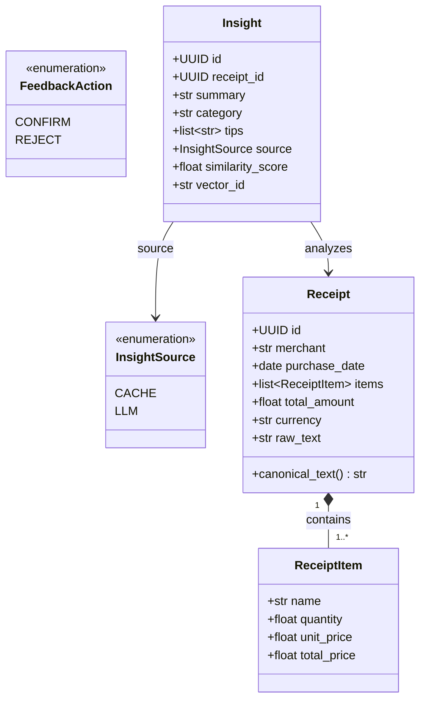

**Mô tả:**
- `ReceiptItem` đại diện một dòng mặt hàng (tên, số lượng, đơn giá, thành tiền).
- `Receipt.canonical_text()` tạo chuỗi chuẩn hóa dùng để embedding — đảm bảo nhất quán khi lookup vector DB.
- `Insight` chứa kết quả phân tích AI: tóm tắt, danh mục, gợi ý tiết kiệm, và nguồn gốc (CACHE / LLM).

---

### 4.2 Backend API (`main.py`, `src/api/routes/`, `src/api/schemas.py`)

Tầng giao tiếp giữa Presentation và Application. FastAPI app tổ chức theo Router, mỗi router quản lý một nhóm endpoint.

```mermaid
classDiagram
    class App {
        +FastAPI app
        +include_router(auth_router)
        +include_router(receipts_router)
        +include_router(feedback_router)
        +include_router(insights_router)
    }

    class AuthRouter {
        +POST /auth/register(body: RegisterRequest) AuthResponse
        +POST /auth/login(body: LoginRequest) AuthResponse
        +GET /auth/me(user: User) UserResponse
    }

    class ReceiptsRouter {
        +POST /receipts/analyze(file: UploadFile, user: User) AnalyzeResponse
    }

    class FeedbackRouter {
        +POST /feedback/{insight_id}(body: FeedbackRequest, user: User) FeedbackResponse
    }

    class InsightsRouter {
        +GET /health() HealthResponse
        +GET /insights(user: User, limit, offset) InsightListResponse
        +GET /insights/{insight_id}(user: User) InsightResponse
    }

    class RegisterRequest {
        +EmailStr email
        +str password
    }

    class LoginRequest {
        +EmailStr email
        +str password
    }

    class FeedbackRequest {
        +FeedbackAction action
        +str vector_id
    }

    class AuthResponse {
        +str access_token
        +str token_type
        +UserResponse user
    }

    class AnalyzeResponse {
        +InsightResponse insight
        +str message
    }

    class InsightListResponse {
        +list~InsightResponse~ insights
        +int total
        +int limit
        +int offset
    }

    App *-- AuthRouter : mounts
    App *-- ReceiptsRouter : mounts
    App *-- FeedbackRouter : mounts
    App *-- InsightsRouter : mounts
    AuthRouter --> RegisterRequest : accepts
    AuthRouter --> LoginRequest : accepts
    AuthRouter --> AuthResponse : returns
    ReceiptsRouter --> AnalyzeResponse : returns
    FeedbackRouter --> FeedbackRequest : accepts
    InsightsRouter --> InsightListResponse : returns
```

**Mô tả:**
- `App` là FastAPI instance khởi tạo trong `main.py` — gắn tất cả router và lifespan event (khởi tạo DB connection, ChromaDB client).
- Mỗi Router tương ứng một file trong `src/api/routes/`, tách biệt theo nghiệp vụ.
- Các `*Request` / `*Response` schema là Pydantic BaseModel — tự động validate input và serialize output, không bao giờ trả thẳng SQLAlchemy ORM model.

---

### 4.3 Pipeline Orchestrator & ToolResult Contract (`src/pipeline.py`, `src/core/tool_result.py`)

`ToolResult` là contract chuẩn hóa — mọi bước trong pipeline đều trả về kiểu này.

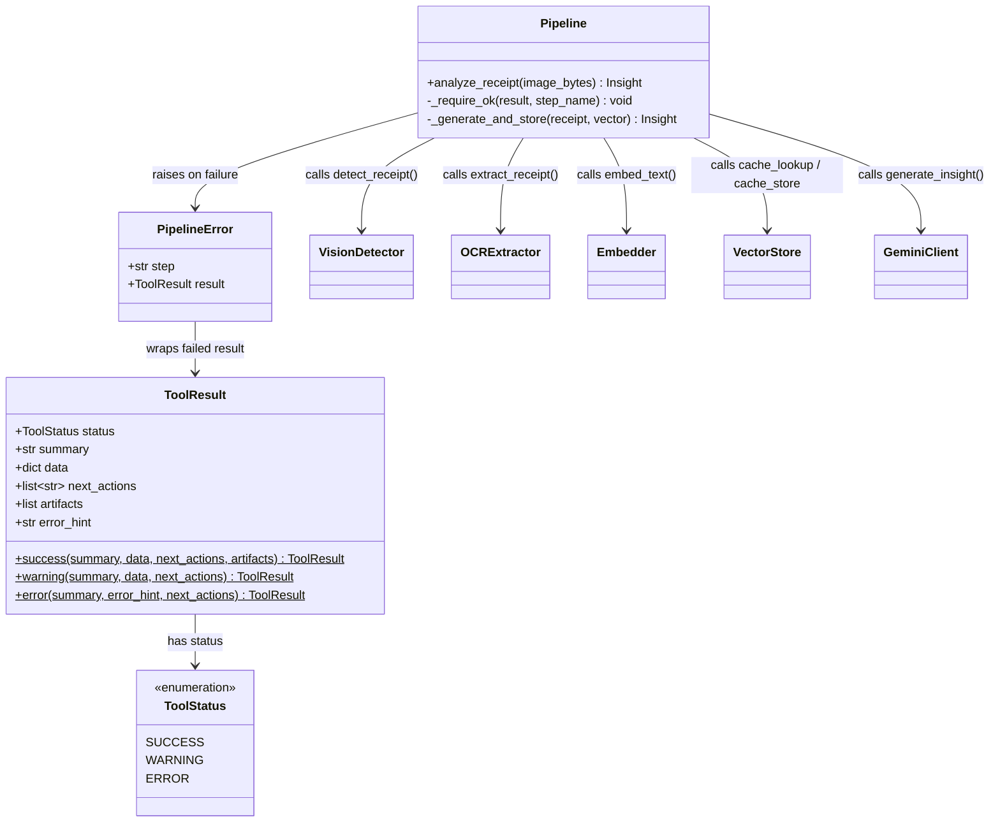

**Mô tả:**
- `Pipeline.analyze_receipt()` là điểm vào duy nhất của Luồng 1. `_require_ok()` kiểm tra status sau mỗi bước — nếu ERROR thì ném `PipelineError` ngay lập tức.
- `_generate_and_store()` gọi LLM rồi lưu cache; lỗi khi lưu cache được xử lý mềm (soft-fail).

---

### 4.4 Vision & OCR Processing — Luồng 1 (`src/vision/`)

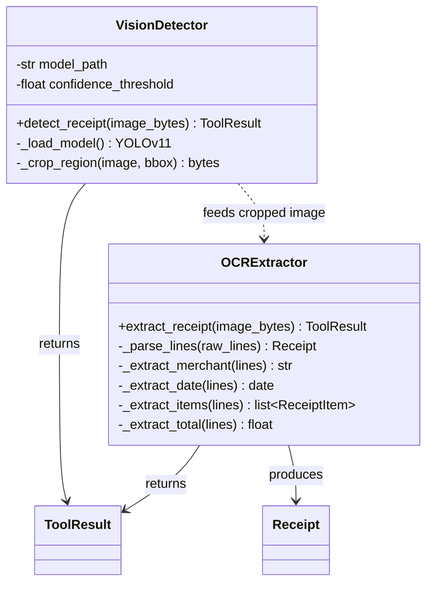

**Mô tả:**
- `VisionDetector` dùng YOLOv11 để phát hiện và cắt vùng hóa đơn từ ảnh gốc (hiện là stub).
- `OCRExtractor` nhận ảnh đã crop, dùng VietOCR trích xuất và parse thành `Receipt` có cấu trúc (hiện là stub).

---

### 4.5 Embedding Module — Luồng 1 (`src/embedding/embedder.py`)

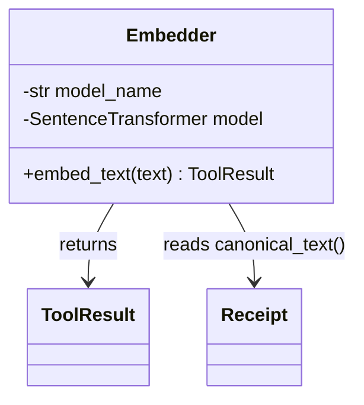

**Mô tả:**
- `Embedder` dùng sentence-transformers (`all-MiniLM-L6-v2`, 384 chiều) để chuyển `Receipt.canonical_text()` thành vector số thực.
- Kết quả vector nằm trong `ToolResult.data["vector"]` — được chuyển tiếp sang `VectorStore` để lookup hoặc store.
- Hiện là stub: trả về vector giả định (deterministic hash) để có thể test pipeline mà không cần model thực.

---

### 4.6 Semantic Cache — Luồng 1 (`src/cache/vector_store.py`)

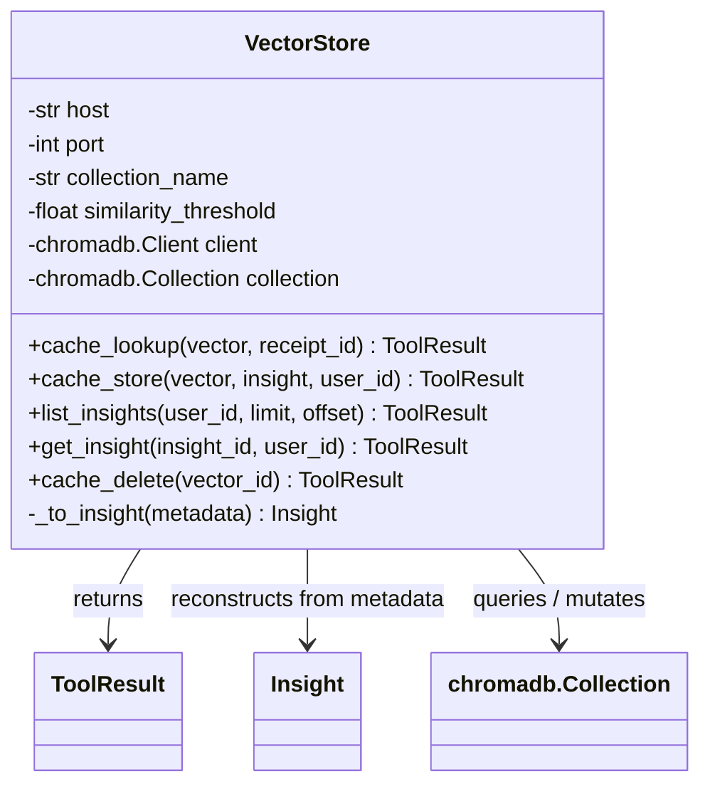

**Mô tả:**
- `cache_lookup()` tính cosine similarity giữa vector mới và toàn bộ collection; nếu max similarity ≥ `similarity_threshold` (0.9) thì trả về cached `Insight` ngay — không gọi LLM.
- `cache_store()` lưu vector + metadata insight vào ChromaDB sau khi LLM sinh xong.
- `cache_delete()` được gọi khi người dùng REJECT insight — xóa document khỏi collection để "unlearn" pattern đó.
- `_to_insight()` reconstruct `Insight` Pydantic object từ ChromaDB metadata dict.

---

### 4.8 LLM Integration — Luồng 1, 3, 4, 5 (`src/llm/gemini_client.py`)

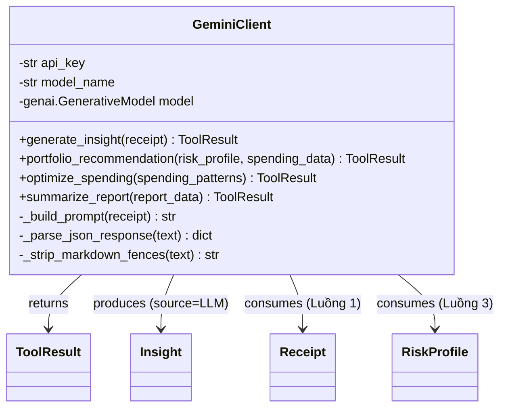

**Mô tả:**
- `generate_insight()` phân tích hóa đơn và trả về JSON (summary, category, tips) — dùng cho Luồng 1.
- `portfolio_recommendation()` đề xuất phân bổ tài sản theo hồ sơ rủi ro — dùng cho Luồng 3 (planned).
- `optimize_spending()` phát hiện chi tiêu bất thường và tạo cảnh báo — dùng cho Luồng 4 (planned).
- `summarize_report()` tổng hợp báo cáo định kỳ — dùng cho Luồng 5 (planned).

---

### 4.9 Cash Flow Service — Luồng 2 (`src/services/cashflow.py`) 🔧 Planned

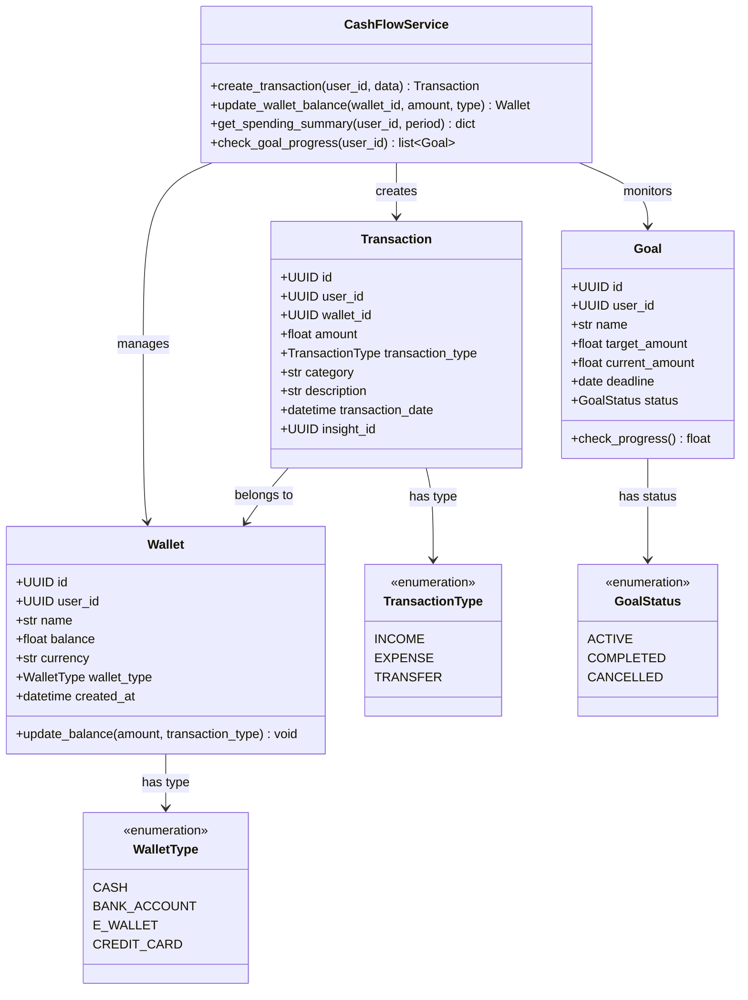

**Mô tả:**
- `CashFlowService` là service chính của Luồng 2, điều phối tạo giao dịch, cập nhật số dư ví và kiểm tra tiến độ mục tiêu.
- `Wallet` hỗ trợ nhiều loại ví: tiền mặt, tài khoản ngân hàng, ví điện tử, thẻ tín dụng.
- `Transaction` liên kết với `insight_id` để map giao dịch với insight từ Luồng 1 (hóa đơn).

---

### 4.10 Investment Advisor — Luồng 3 (`src/services/investment.py`) 🔧 Planned

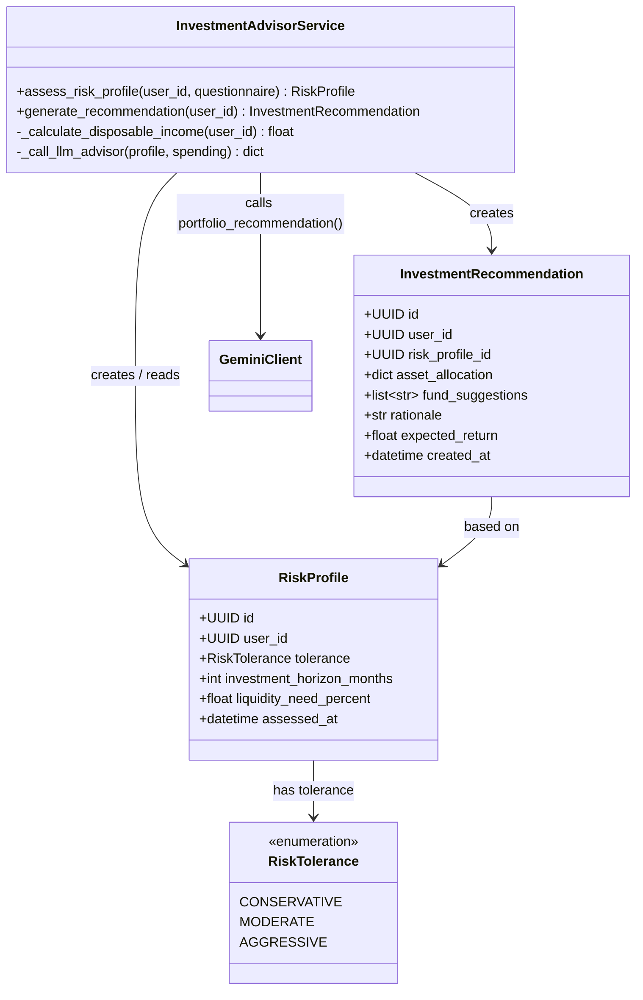

**Mô tả:**
- `RiskProfile` lưu kết quả đánh giá hồ sơ rủi ro người dùng (khẩu vị rủi ro, horizon đầu tư, nhu cầu thanh khoản).
- `InvestmentAdvisorService` tính thu nhập khả dụng từ lịch sử giao dịch, sau đó gọi Gemini để đề xuất phân bổ tài sản.

---

### 4.11 Resource Optimization Service — Luồng 4 (`src/services/optimization.py`) 🔧 Planned

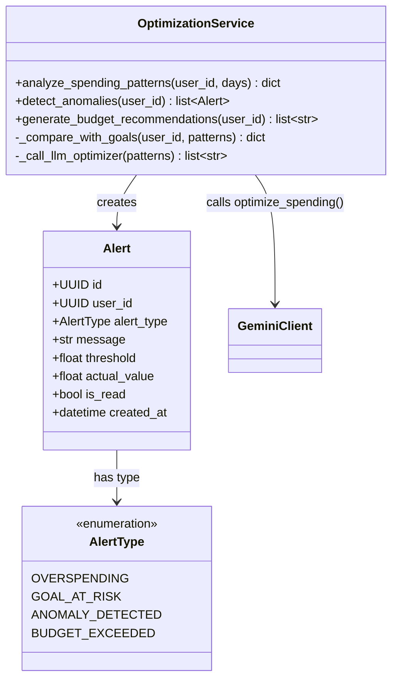

**Mô tả:**
- `OptimizationService` phân tích pattern chi tiêu N ngày gần nhất, phát hiện bất thường, so sánh với mục tiêu tài chính.
- Tạo `Alert` khi phát hiện vi phạm ngưỡng (chi tiêu vượt mức, mục tiêu có nguy cơ, anomaly).
- Gọi `GeminiClient.optimize_spending()` để sinh gợi ý tối ưu ngân sách bằng ngôn ngữ tự nhiên.

---

### 4.12 Reporting Service — Luồng 5 (`src/services/reporting.py`) 🔧 Planned

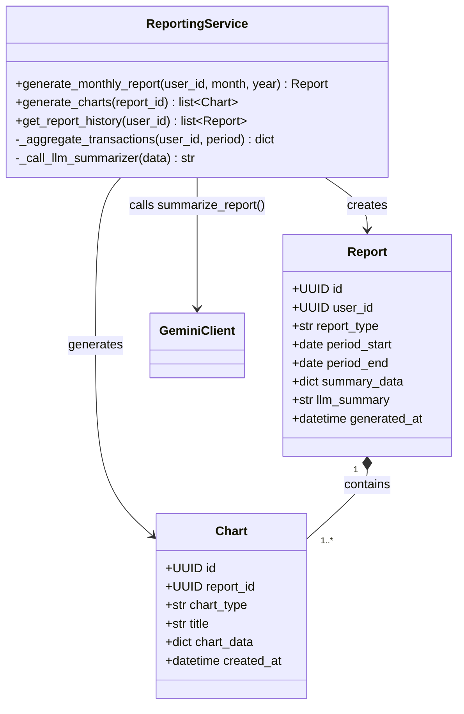

**Mô tả:**
- `ReportingService` tổng hợp dữ liệu giao dịch theo kỳ (tháng / quý / năm) thành `summary_data`.
- Gọi `GeminiClient.summarize_report()` để tạo tóm tắt ngôn ngữ tự nhiên (`llm_summary`).
- Sinh metadata biểu đồ `Chart` (PIE, BAR, LINE) để Presentation Layer render — không chứa logic render.

---

### 4.13 Authentication Layer (`src/auth/`, `src/db/models.py`)

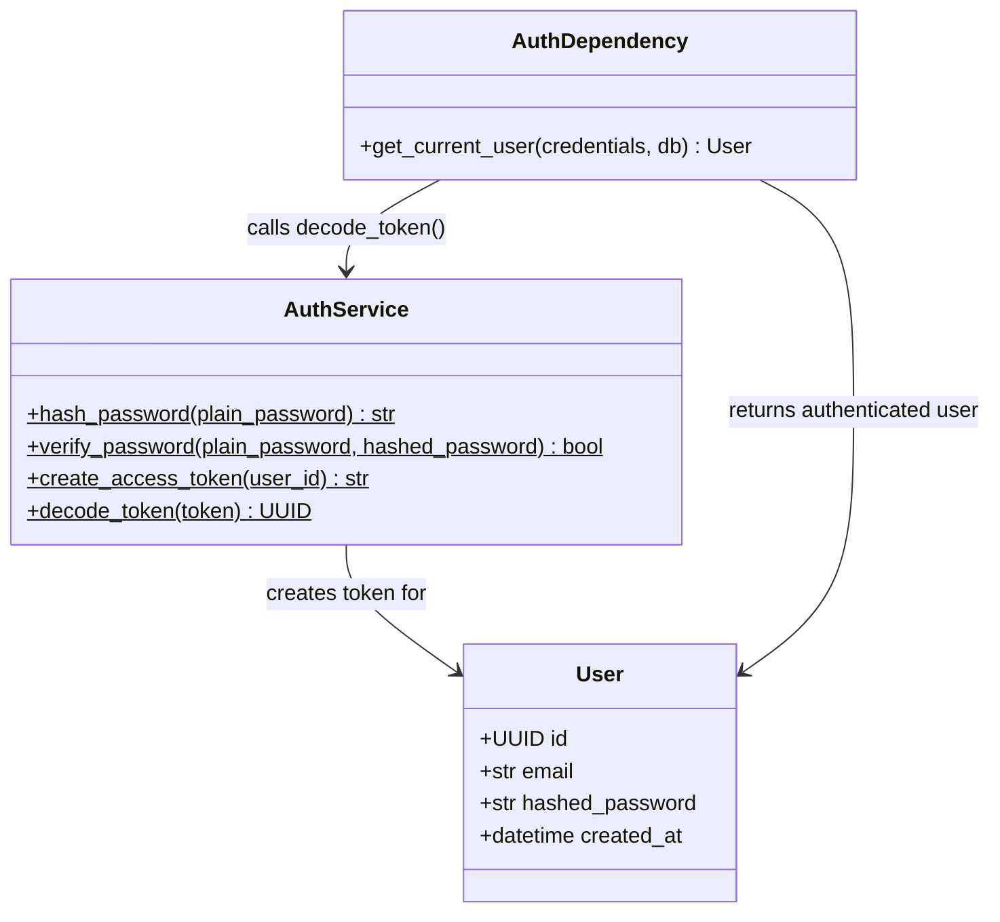

**Mô tả:**
- `User` là SQLAlchemy ORM model, ánh xạ trực tiếp tới bảng `users` trong PostgreSQL.
- `AuthService` chứa static method: hash bcrypt, verify bcrypt, tạo JWT, decode JWT.
- `AuthDependency.get_current_user()` là FastAPI dependency — inject vào mọi route cần xác thực.

---

## 5. Database Design — Thiết kế Cơ sở dữ liệu

### 5.1 Entity Relationship Diagram (PostgreSQL)

SpendSense AI sử dụng PostgreSQL cho dữ liệu quan hệ (9 bảng) và ChromaDB cho vector cache.

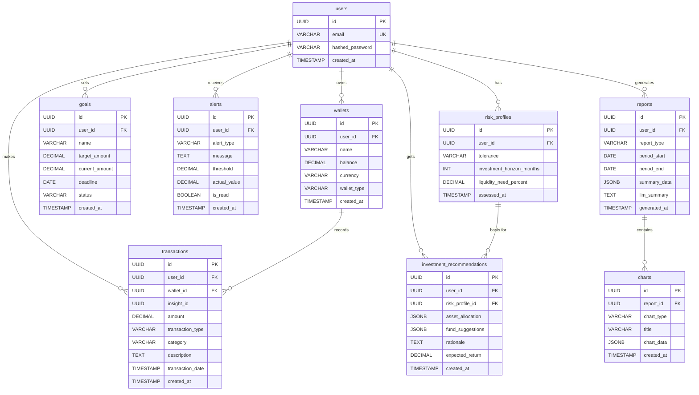

---

### 5.2 ChromaDB Vector Collection

ChromaDB lưu insight dưới dạng **document** gồm ba phần: ID, Embedding, Metadata.

| Trường metadata | Kiểu | Mô tả |
|-----------------|------|-------|
| `user_id` | str (UUID) | Liên kết với `users.id` — lọc insight theo người dùng |
| `receipt_id` | str (UUID) | ID của `Receipt` đã phân tích |
| `summary` | str | Tóm tắt chi tiêu do AI tạo |
| `category` | str | Danh mục (food, transport, shopping...) |
| `tips` | str (JSON array) | Danh sách gợi ý tiết kiệm |
| `source` | str | `"LLM"` hoặc `"CACHE"` |
| `created_at` | str (ISO datetime) | Thời điểm lưu vào cache |

**Embedding:** vector 384 chiều (float32) từ sentence-transformers `all-MiniLM-L6-v2`.

**Semantic Cache:** cosine similarity ≥ 0.9 → trả về cached insight, bỏ qua LLM (tiết kiệm ~80% chi phí API).

**Unlearning:** REJECT → `cache_delete(vector_id)` xóa document khỏi collection.

---

### 5.3 Mô tả các Bảng PostgreSQL

#### Bảng `users`

| Cột | Kiểu | Ràng buộc | Mô tả |
|-----|------|-----------|-------|
| `id` | UUID | PK | Khóa chính tự sinh (gen_random_uuid()) |
| `email` | VARCHAR(255) | UNIQUE, NOT NULL | Email đăng nhập |
| `hashed_password` | VARCHAR(255) | NOT NULL | Mật khẩu băm bcrypt |
| `created_at` | TIMESTAMP | NOT NULL, DEFAULT now() | Thời điểm tạo tài khoản |

#### Bảng `wallets`

| Cột | Kiểu | Mô tả |
|-----|------|-------|
| `id` | UUID PK | Khóa chính |
| `user_id` | UUID FK | Chủ sở hữu ví |
| `name` | VARCHAR(100) | Tên ví (ví dụ: "Tài khoản MB Bank") |
| `balance` | DECIMAL(15,2) | Số dư hiện tại |
| `currency` | VARCHAR(10) | Đơn vị tiền (VND, USD) |
| `wallet_type` | VARCHAR(20) | CASH / BANK_ACCOUNT / E_WALLET / CREDIT_CARD |

#### Bảng `transactions`

| Cột | Kiểu | Mô tả |
|-----|------|-------|
| `id` | UUID PK | Khóa chính |
| `user_id` | UUID FK | Người thực hiện giao dịch |
| `wallet_id` | UUID FK | Ví được dùng |
| `insight_id` | UUID | Liên kết với insight từ Luồng 1 (nullable) |
| `amount` | DECIMAL(15,2) | Số tiền |
| `transaction_type` | VARCHAR(20) | INCOME / EXPENSE / TRANSFER |
| `category` | VARCHAR(100) | Danh mục chi tiêu |
| `description` | TEXT | Mô tả giao dịch |
| `transaction_date` | TIMESTAMP | Thời điểm thực hiện |

#### Bảng `goals`

| Cột | Kiểu | Mô tả |
|-----|------|-------|
| `id` | UUID PK | Khóa chính |
| `user_id` | UUID FK | Chủ mục tiêu |
| `name` | VARCHAR(200) | Tên mục tiêu (ví dụ: "Mua xe máy") |
| `target_amount` | DECIMAL(15,2) | Số tiền mục tiêu |
| `current_amount` | DECIMAL(15,2) | Số tiền đã tích lũy |
| `deadline` | DATE | Hạn chót |
| `status` | VARCHAR(20) | ACTIVE / COMPLETED / CANCELLED |

#### Bảng `alerts`

| Cột | Kiểu | Mô tả |
|-----|------|-------|
| `id` | UUID PK | Khóa chính |
| `user_id` | UUID FK | Người nhận cảnh báo |
| `alert_type` | VARCHAR(50) | OVERSPENDING / GOAL_AT_RISK / ANOMALY_DETECTED / BUDGET_EXCEEDED |
| `message` | TEXT | Nội dung cảnh báo |
| `threshold` | DECIMAL(15,2) | Ngưỡng cảnh báo |
| `actual_value` | DECIMAL(15,2) | Giá trị thực tế vi phạm |
| `is_read` | BOOLEAN | Đã đọc chưa |

#### Bảng `risk_profiles`

| Cột | Kiểu | Mô tả |
|-----|------|-------|
| `id` | UUID PK | Khóa chính |
| `user_id` | UUID FK | Chủ hồ sơ |
| `tolerance` | VARCHAR(20) | CONSERVATIVE / MODERATE / AGGRESSIVE |
| `investment_horizon_months` | INT | Thời gian đầu tư (tháng) |
| `liquidity_need_percent` | DECIMAL(5,2) | % tài sản cần thanh khoản ngay |
| `assessed_at` | TIMESTAMP | Thời điểm đánh giá |

#### Bảng `investment_recommendations`

| Cột | Kiểu | Mô tả |
|-----|------|-------|
| `id` | UUID PK | Khóa chính |
| `user_id` | UUID FK | Người nhận đề xuất |
| `risk_profile_id` | UUID FK | Hồ sơ rủi ro cơ sở |
| `asset_allocation` | JSONB | Phân bổ tài sản (% cổ phiếu, trái phiếu, tiền mặt...) |
| `fund_suggestions` | JSONB | Danh sách quỹ / ETF gợi ý |
| `rationale` | TEXT | Giải thích lý do đề xuất (từ LLM) |
| `expected_return` | DECIMAL(5,2) | % lợi nhuận kỳ vọng hàng năm |

#### Bảng `reports`

| Cột | Kiểu | Mô tả |
|-----|------|-------|
| `id` | UUID PK | Khóa chính |
| `user_id` | UUID FK | Chủ báo cáo |
| `report_type` | VARCHAR(50) | MONTHLY / QUARTERLY / ANNUAL / CUSTOM |
| `period_start` | DATE | Ngày bắt đầu kỳ báo cáo |
| `period_end` | DATE | Ngày kết thúc kỳ báo cáo |
| `summary_data` | JSONB | Dữ liệu tổng hợp (tổng thu, chi, theo danh mục) |
| `llm_summary` | TEXT | Tóm tắt tự nhiên do Gemini tạo |

#### Bảng `charts`

| Cột | Kiểu | Mô tả |
|-----|------|-------|
| `id` | UUID PK | Khóa chính |
| `report_id` | UUID FK | Báo cáo chứa biểu đồ này |
| `chart_type` | VARCHAR(50) | PIE / BAR / LINE / AREA |
| `title` | VARCHAR(200) | Tiêu đề biểu đồ |
| `chart_data` | JSONB | Dữ liệu biểu đồ (labels, datasets) |

---

## 6. Luồng Xử lý Chính (Key Sequences)

### 6.1 Phân tích Hóa đơn (POST /receipts/analyze) — Luồng 1

```
Client → POST /receipts/analyze (image file)
    │
    ▼
[Auth Dependency] → validate JWT → resolve User
    │
    ▼
[Pipeline.analyze_receipt(image_bytes)]
    │
    ├─[1] VisionDetector.detect_receipt()     → ToolResult {cropped_bytes}
    ├─[2] OCRExtractor.extract_receipt()       → ToolResult {Receipt}
    ├─[3] Embedder.embed_text(canonical_text)  → ToolResult {vector[384]}
    ├─[4] VectorStore.cache_lookup(vector)
    │       ├─ HIT (sim ≥ 0.9) → return Insight (source=CACHE)
    │       └─ MISS
    │             ├─[5a] GeminiClient.generate_insight(Receipt)
    │             └─[5b] VectorStore.cache_store(vector, Insight)
    │
    ▼
[API] serialize Insight → AnalyzeResponse → 200 OK
```

### 6.2 Feedback / Unlearning (POST /feedback/{insight_id})

```
Client → POST /feedback/{insight_id} {action: CONFIRM|REJECT, vector_id}
    │
    ▼
[Auth Dependency] → validate JWT
    │
    ├─ CONFIRM → no-op (vector giữ lại trong ChromaDB)
    └─ REJECT  → VectorStore.cache_delete(vector_id) → xóa khỏi ChromaDB
    │
    ▼
FeedbackResponse {status: "ok"} → 200 OK
```

### 6.3 Cập nhật Ví / Giao dịch — Luồng 2 (Planned)

```
Client → POST /wallets/transactions {wallet_id, amount, type, category}
    │
    ▼
[Auth Dependency] → validate JWT
    │
    ▼
[CashFlowService.create_transaction(user_id, data)]
    │
    ├── INSERT INTO transactions
    ├── UPDATE wallets SET balance = balance ± amount
    └── check_goal_progress(user_id) → cập nhật goals.current_amount
    │
    ▼
TransactionResponse → 201 Created
```

### 6.4 Tạo Báo cáo — Luồng 5 (Planned)

```
Client → POST /reports/generate {period_start, period_end, report_type}
    │
    ▼
[Auth Dependency] → validate JWT
    │
    ▼
[ReportingService.generate_monthly_report(user_id, period)]
    │
    ├── SELECT transactions WHERE user_id AND period
    ├── _aggregate_transactions() → summary_data dict
    ├── GeminiClient.summarize_report(summary_data) → llm_summary
    ├── INSERT INTO reports
    └── generate_charts(report_id) → INSERT INTO charts
    │
    ▼
ReportResponse {report_id, llm_summary, charts} → 201 Created
```

---

## 7. Quyết định Kiến trúc Quan trọng

| Quyết định | Lý do |
|---|---|
| ToolResult contract cho mọi bước pipeline | Xử lý lỗi nhất quán, dễ debug từng bước mà không cần try/except lồng nhau |
| Async FastAPI + asyncpg | Không block thread khi chờ DB / LLM, phù hợp với workload I/O-heavy |
| Pydantic cho mọi model | Tự động validate, serialize/deserialize, type safety |
| ChromaDB cho semantic cache | Cosine similarity search sub-millisecond, không cần viết ranking algorithm |
| Stub pattern cho AI tools | Cho phép phát triển và test pipeline mà không cần model thực tế |
| JWT stateless auth | Không cần session store, phù hợp với kiến trúc stateless REST API |
| JSONB cho structured data (PostgreSQL) | Lưu asset_allocation, fund_suggestions, chart_data linh hoạt mà không cần bảng phụ |
| Gemini 2.5 Flash cho tất cả LLM tasks | Balance tốt giữa chất lượng và chi phí; dùng Flash thay vì Pro trừ khi output không đủ |
| 5 luồng độc lập | Mỗi luồng có service riêng — dễ mở rộng, test, và scale độc lập |
| Semantic cache trước LLM | Giảm ~80% LLM API calls — tiết kiệm chi phí và giảm latency |
