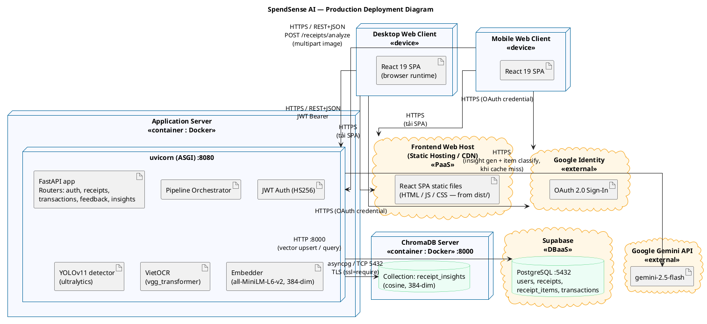

# Deployment Diagram — SpendSense AI

---

## 1. Mục đích & Phạm vi

Tài liệu này mô tả **sơ đồ triển khai (UML Deployment Diagram)** của SpendSense AI — thể hiện các **node** (thiết bị / máy chủ / dịch vụ đám mây) thực thi các thành phần của hệ thống và các **liên kết** giao tiếp giữa chúng.

SpendSense AI là một **ứng dụng Web**, nên theo đúng mô hình web-based, sơ đồ gồm các nhóm node:
- **Web clients** — trình duyệt trên máy tính (desktop) và trên điện thoại (mobile).
- **Web/Application server** — máy chủ chạy backend và máy chủ tĩnh phân phối giao diện.
- **Data nodes** — cơ sở dữ liệu quan hệ và vector store.
- **External services** — các dịch vụ đám mây bên thứ ba (LLM, OAuth).

Các node kết nối với nhau qua **HTTP/HTTPS** (và TCP có TLS cho database).

> **Phạm vi:** Sơ đồ mô tả **kiến trúc triển khai production mục tiêu**, chỉ gồm các thành phần **đã được hiện thực trong mã nguồn** (không bao gồm các hạ tầng dự kiến ở Phase 2/3 như Redis, RabbitMQ/Celery, Milvus, Kubernetes).

### Quy ước UML sử dụng

| Ký hiệu | Ý nghĩa |
|---------|---------|
| `node «device»` | Thiết bị vật lý của người dùng cuối |
| `node «container»` | Môi trường thực thi đóng gói (Docker) trên máy chủ |
| `cloud «...»` | Dịch vụ chạy trên hạ tầng đám mây bên ngoài |
| `artifact` | Thành phần phần mềm được triển khai (deployable unit) |
| `database` | Kho dữ liệu lưu trữ bền vững |
| Mũi tên `-->` | Liên kết giao tiếp, nhãn ghi rõ protocol/payload |

---

## 2. Sơ đồ Triển khai (PlantUML)



---

## 3. Mô tả các Node

| Node | Stereotype | Thành phần chạy trên node | Vai trò |
|------|------------|---------------------------|---------|
| **Desktop Web Client** | `«device»` | React 19 SPA trong trình duyệt (Chrome/Firefox/Safari/Edge) | Người dùng trên máy tính: xem dashboard, insight, biểu đồ; upload ảnh hóa đơn; gửi feedback. Không chứa logic nghiệp vụ. |
| **Mobile Web Client** | `«device»` | React 19 SPA trong trình duyệt di động (iOS Safari / Android Chrome) | Cùng một SPA như desktop, truy cập qua trình duyệt điện thoại. Là client web — **không có app native**. |
| **Frontend Web Host** (Static Hosting / CDN) | `«PaaS»` (cloud) | Các file tĩnh đã build của SPA (`frontend/dist/`: HTML/JS/CSS) | **Chỉ phục vụ file giao diện** (frontend), **không** chứa API. Khi người dùng mở URL, trình duyệt tải SPA từ node này; sau đó SPA tự gọi API sang **Application Server**. Dùng dịch vụ tĩnh có CDN edge (Vercel/Netlify-class) để tải nhanh. |
| **Application Server** | `«container : Docker»` | `uvicorn` (ASGI) cổng **8080** chạy FastAPI + Pipeline + JWT Auth + các model AI in-process (YOLOv11, VietOCR, sentence-transformers) | Lõi xử lý của hệ thống: nhận request REST, điều phối pipeline phân tích hóa đơn, sinh insight, xác thực. Các model AI chạy **trong cùng tiến trình backend**, không tách thành dịch vụ riêng. |
| **ChromaDB Server** | `«container : Docker»` | ChromaDB cổng **8000**, collection `receipt_insights` (cosine, vector 384 chiều) | Semantic cache: tra cứu tương đồng (similarity ≥ 0.9) để tái sử dụng insight, giảm chi phí gọi LLM. Lưu embedding + metadata insight. |
| **Supabase (PostgreSQL)** | `«DBaaS»` (cloud) | PostgreSQL managed cổng **5432** | Lưu trữ quan hệ bền vững: `users`, `receipts`, `receipt_items`, `transactions`. Chỉ Application Server truy cập, qua TLS. |
| **Google Gemini API** | `«external»` (cloud) | `gemini-2.5-flash` | LLM bên ngoài: sinh insight tài chính và phân loại item hóa đơn — **chỉ được gọi khi cache miss**. |
| **Google Identity** | `«external»` (cloud) | OAuth 2.0 Sign-In | Đăng nhập Google: client lấy credential rồi gửi về backend `/auth/google` để đổi lấy JWT. |

---

## 4. Mô tả các Liên kết (Communication)

| Từ → Đến | Protocol | Payload / Endpoint | Bảo mật |
|----------|----------|--------------------|---------|
| Web Client → CDN | HTTPS | Tải bản SPA tĩnh | TLS |
| Web Client → Application Server | HTTPS, REST+JSON | API nghiệp vụ; `POST /receipts/analyze` gửi ảnh dạng multipart | JWT Bearer token (HS256), lưu ở `localStorage` |
| Web Client → Google Identity | HTTPS | Lấy OAuth credential (Google Sign-In) | OAuth 2.0; credential sau đó POST tới `/auth/google` |
| Application Server → Supabase PostgreSQL | TCP 5432 (driver `asyncpg`) | SQL: đọc/ghi users, receipts, transactions | TLS bắt buộc (`ssl=require`) |
| Application Server → ChromaDB Server | HTTP :8000 | `cache_lookup` / `cache_store` (upsert & query vector) | Mạng nội bộ (cùng cụm triển khai) |
| Application Server → Google Gemini API | HTTPS | `generateContent` — sinh insight & phân loại item, khi cache miss | API key (`GEMINI_API_KEY`) |

---

## 5. Cấu trúc Thư mục (Folder Structure)

Mỗi node lưu trữ mã nguồn có cấu trúc thư mục riêng. Phần này chỉ liệt kê **các thư mục chính** (bỏ qua `node_modules/`, `.venv/`, `__pycache__/`, `.git/`, cache build). Các node dữ liệu (PostgreSQL, ChromaDB) không chứa mã nguồn nên không có cây thư mục.

### 5.1. Application Server (Backend — FastAPI)

```text
SpendSense-AI/                  ← thư mục gốc deploy lên Application Server
├── main.py                     # Entry point FastAPI (uvicorn :8080)
├── pyproject.toml              # Khai báo dependencies (quản lý bằng uv)
├── uv.lock                     # Lock file phiên bản dependencies
├── alembic.ini                 # Cấu hình migration cơ sở dữ liệu
├── .env                        # Biến môi trường / secrets (GEMINI_API_KEY, DATABASE_URL, JWT_SECRET_KEY)
│
├── src/                        # ★ Toàn bộ mã nguồn ứng dụng
│   ├── api/                    #   Tầng HTTP
│   │   ├── routes/             #     Handler endpoint: auth, receipts, transactions, feedback, insights
│   │   └── schemas.py          #     Pydantic request/response models
│   ├── core/                   #   Config, logging, ToolResult contract
│   ├── auth/                   #   JWT auth, dependencies, service
│   ├── db/                     #   SQLAlchemy engine (base.py) + ORM models (models.py)
│   ├── models/                 #   Domain models (Receipt, ReceiptItem, Insight…)
│   ├── vision/                 #   YOLOv11 detector, VietOCR, reconstructor
│   ├── embedding/              #   sentence-transformers embedder
│   ├── cache/                  #   ChromaDB vector store (semantic cache)
│   ├── llm/                    #   Gemini API client
│   └── pipeline.py             #   Orchestrator: detect → OCR → embed → cache → LLM
│
├── migrations/                 # Alembic migration scripts
│   └── versions/               #   Các phiên bản schema
│
├── docs/                       # Tài liệu (SAD, SDP, SRS, deployment, testing)
│
└── models/                     # (supporting) Trọng số model tải về & cache lúc runtime
                                #   — YOLO .pt từ Hugging Face Hub; thư mục này được gitignore
```

### 5.2. Frontend Host (Static Hosting / CDN)

```text
frontend/                       ← mã nguồn frontend; sau khi build, thư mục dist/ được deploy lên CDN
├── index.html                  # HTML entry của SPA
├── package.json                # npm dependencies + scripts (vite build)
├── vite.config.ts              # Cấu hình build & dev server
├── tailwind.config.js          # Design tokens (màu, typography)
├── .env                        # VITE_API_URL, VITE_GOOGLE_CLIENT_ID
│
├── public/                     # Asset tĩnh copy nguyên trạng (favicon, icons)
│
├── src/                        # ★ Mã nguồn React 19 + TypeScript
│   ├── main.tsx                #   Điểm khởi tạo React
│   ├── App.tsx                 #   Router + AuthProvider shell
│   ├── pages/                  #   Dashboard, Analytics, Goals, Investment, Settings, Login
│   ├── components/             #   AddTransactionModal + layout/ + ui/ (shadcn)
│   ├── lib/                    #   api.ts (REST client), auth.tsx, utils.ts
│   ├── data/                   #   Dữ liệu demo
│   └── assets/                 #   Hình ảnh (hero.png, svg)
│
└── dist/                       # ★ Artifact build (sinh ra bởi `npm run build`) — đây là thứ CDN phục vụ
    ├── index.html
    └── assets/                 #   Bundle JS/CSS đã hash
```

---

## 6. Ghi chú

- **AI models chạy in-process:** YOLOv11, VietOCR và sentence-transformers được nạp và thực thi **bên trong tiến trình FastAPI** (cùng container Application Server), không phải dịch vụ tách rời. Model được tải từ Hugging Face Hub và cache cục bộ ở lần dùng đầu.
- **OCR engine:** OCR được hiện thực bằng **VietOCR** (`vgg_transformer`), tối ưu cho tiếng Việt (`src/vision/ocr.py`).
- **Cache-first:** Pipeline luôn tra ChromaDB trước; chỉ gọi Gemini API khi không tìm thấy insight tương đồng (cosine < 0.9), giúp tối thiểu chi phí LLM.
- **Render sơ đồ:** dán khối ```plantuml``` ở Mục 2 vào [PlantUML Web Server](https://www.plantuml.com/plantuml) hoặc chạy `plantuml -tpng docs/deployment.md` để xuất ảnh.
